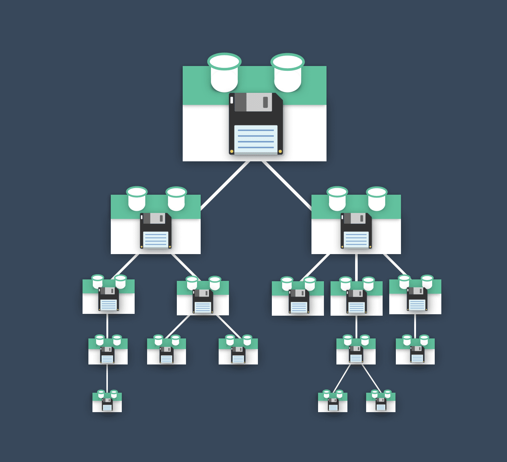
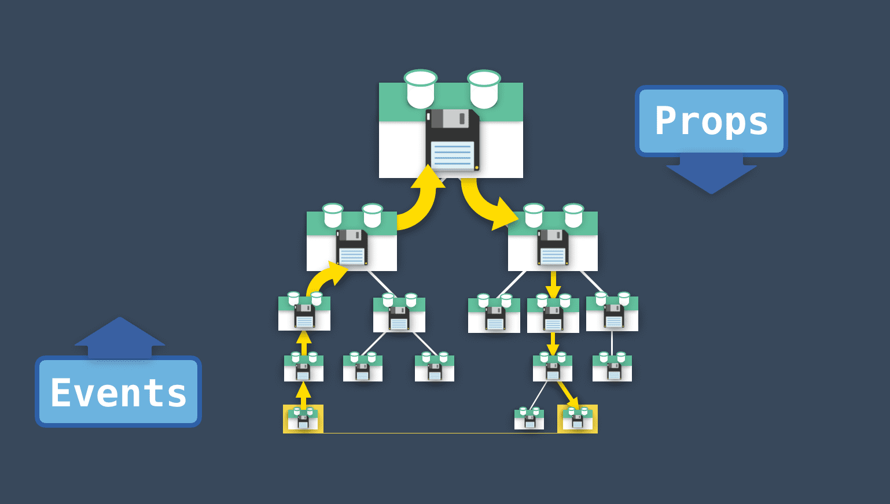
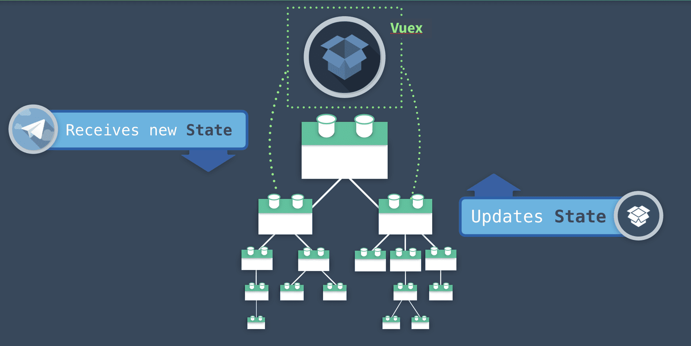
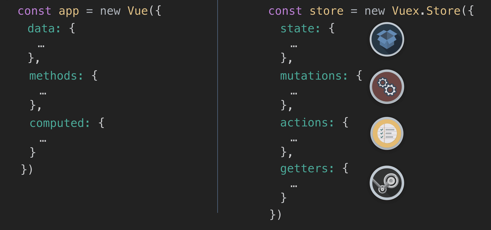
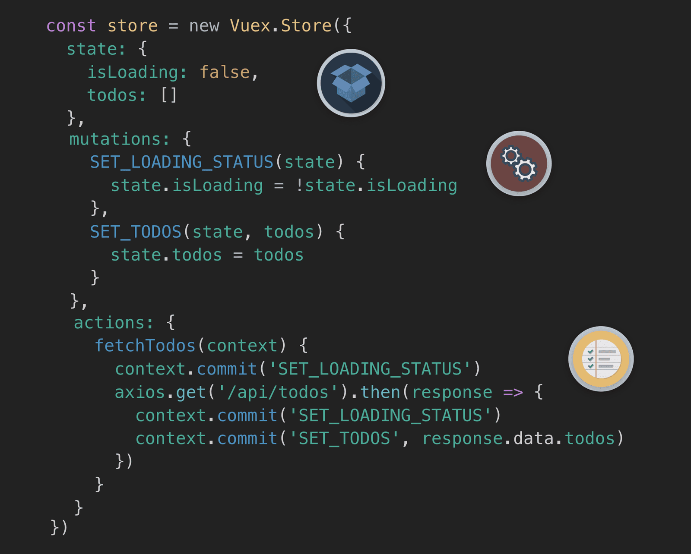
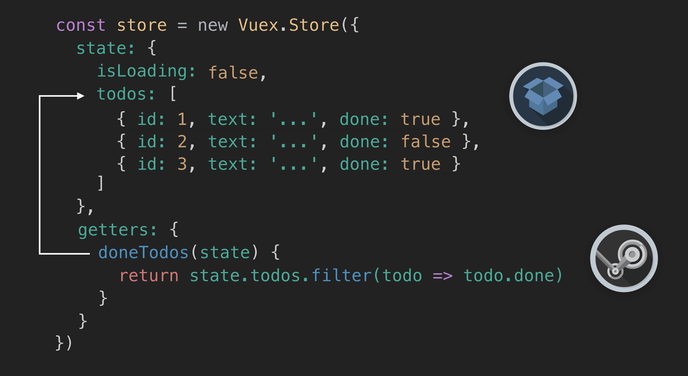

<link rel="stylesheet" href="assets/style.css" type="text/css" />
## ⚠️ 狀態管理的案例

管理一個充滿組件的應用程式中的狀可能是很困難的一件事。臉書發現到了這個困難點而開創了 Flux 模型，Vuex 便是以此為基礎所建立的。Vuex 時 Vue 自有的狀態管理模式和程式庫。在這份文件中，我們可以學習到為什麼一個應用程式要用到 Vuex 以及要如何利用他來改進我們的應用程式。

當我們談到狀態(*state*)時，我們指的是我們應用程式中組件所依賴和用以渲染的資料。像是部落格貼文，to-do 工作項目等等。要是沒有 Vuex，未來在我們的應用程式漸漸成長時，每個組件可能會有他自己版本的狀態(想到就可怕😨)。

但加入一個組件改變了它自己的狀態，而某個遠房親戚也用到了相同狀態時，我們就需要告訴那個組件狀態已經改變囉。這是溝通事件發動並且傳遞下去以分享資料的預設方法，但這樣是在是複雜的太超過了。

---------------------

**單一信息來源**，這是 Vuex 所想要提供的功能，而且每一個組件可以直接存取這個全域的狀態。

就好比 Vue 實體的 `data`，這邊的 State(*狀態*)是有響應(*reactive*)作用的。當一個組件更新狀態時，其他使用相同資料的組件會收到通知，進而自動接受更新的值。

可是僅僅將資料鞏固到單一信息來源還不能完全解決管理狀態的問題。試著想像，當許多組件以不同的途徑，從不同位置更改狀態時會發生什麼事呢？

所以我們需要某種標準化。否則如此一來，我們在改變狀態內容時可能獲得無法預測和追蹤的結果。

----------------------

**一個狀態管理模式**，這就是 Vuex 為什麼提供了一個為了簡化及標準化改變狀態的狀態管理模型。如果我們對 Vue 熟悉的話，Vuex 看起來和它十分相似。

正如 Vue 以 `new Vue` 創建 Vue 實體，Vuex 提供了 `new Vuex.Store` 來創建 Store。

Vue 實體有 `data` 屬性，Vuex store 則有 `state`。兩者都有響應作用。而且 Vue 實體有 `methods` 可以用來更新 `data`，Vuex store 則有 `actions` 能夠更新 `state`。再來 Vue 實體還有 `computed` 屬性，Vuex 則有 `getters` 可以讓我們存取篩選，衍生或計算過的 `state`。

另外 Vuex 藉由一個叫做 **Mutations**的東西提供了一個可以*追蹤*變更的方式。我們能利用 **Actions** 來交付 **Mutations**，而且從 Vue DevTools 工具中我們甚至還能藉由每一次 Mutation 對 State 交付的記錄來追蹤來龍去脈。

讓我們來看看下面這個 Vuex Store 的例子。

在 **State** 中，我們有個 isLoading 的屬性和另一個 todos 陣列。

在下面我們有個 **Mutation** 來切換 isLoading 狀態為 `true` 或 `false`。和另一個從下面 actions 呼叫 API 以接收資料來設定 state 的 todos 陣列的 Mutation。

再往下看我們的 **Action**，裡面有多個步驟。首先它會交付 Mutation 以便將 isLoading 設定為 `true`。然後會呼叫 API，當回傳 response 時，就會交付 Mutation 將 isLoading 設定為 `false`。最後則是交付 Mutation 來以從 API 回傳的 todos 資料交付給我們的 `todos` State。

如果我們只想要取得那些標示為完成的 todos，我們可以利用 **Getter**，他會幫我們只取回我們想要的 state。

現在讓我們來看看它實際跑起來的樣子

## Vuex 動畫版

