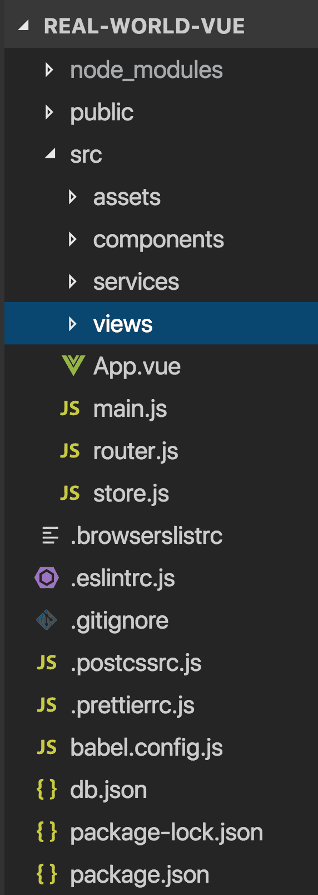

<link rel="stylesheet" href="assets/style.css" type="text/css" />
## 邁向 Vuex 大師之路

在這個章節中會為大家介紹範這個課程所用的範例應用程式。

在學習這門教學的先備知識有：

- Vue CLI
- Vue Router
- 單一的 .vue 組件檔
- 以 Axios 呼叫 API

---------------

## 下載範例

範例應用程式可以從 [github](https://github.com/Code-Pop/real-world-vue/releases/tag/lesson11-vuex-start) 下載，請先下載到你的電腦上。

## 啟動並執行應用程式

如果是從終端機介面瀏覽專案資料夾，我們可以執行 `npm install` 指令先安裝好專案的相依函式庫。

因為我們的應用程式會呼叫 API，所以我們會用到 [json-server](https://github.com/typicode/json-server) 這個工具。它是一個模擬的 REST API 伺服器，我們可以用它來從模擬的資料庫(*雖說是資料庫，但不過就是一個 json 檔案*)中呼叫 REST API。如果還沒安裝這個工具，可以在終端機輸入 `npm install -g json-server` 來安裝它。安裝好之後再執行：`json-server --watch db.json`，便會啟動伺服器以及*監視*我們所指定的 db.json 檔案來模擬資料庫。

現在我們來試試看把應用程式叫起來，執行這個指令 `npm run serve` 看看，執行完畢後伺服器會讓我們知道它在哪個 port 上面跑。

-----------------

## 在瀏覽器上執行應用程式

當伺服器啟動成功後，打開瀏覽器在位址列輸入 localhost:port 我們就可以看到應用程式。

在主頁，我們會顯示從 API 呼叫抓回來的 event 活動列表。當按下其中一個活動時，會連到 `event-show` 頁面，裡面會顯示活動的詳細資訊。我們利用 Vue Router 來達成網站導覽的功能，讓我們可以在不同頁面中切換。

現在再讓我們看看專案的內容。

## App 導覽

因為使用率 Vue CLI 來建立 app，所以得到了以下的資料夾結構。



在 **views** 資料夾裡面有3個組件，會在我們瀏覽到使用它們的頁面時被載入。

目前 **EventCreate** 組件裡面只是一個簡單的樣板。

📃 **/src/views/EventCreate.vue**

```javascript
    <template>
      <h1>Create Event</h1>
    </template>
```

**EventList** 組件的內容：

```javascript
    <script>
    import EventCard from '@/components/EventCard.vue'
    import EventService from '@/services/EventService.js'
    
    export default {
      components: {
        EventCard
      },
      data() {
        return {
          events: []
        }
      },
      created() {
        EventService.getEvents()
          .then(response => {
            this.events = response.data
          })
          .catch(error => {
            console.log('There was an error:', error.response)
          })
      }
    }
    </script>
```

當這個組件被建立的時候，我們會呼叫 API `EventService.getEvents()` 來取得活動資料。然後我們會將組件的 `enents` 資料帶入 response 的結果。而且我們也會捕捉錯誤，如果呼叫 API 有錯誤就會在 console 上面輸出錯誤內容。

📃 **/src/views/EventList.vue**

```javascript
    <template>
      <div>
        <h1>Events Listing</h1>
        <EventCard v-for="event in events" :key="event.id" :event="event"/>
      </div>
    </template>
```

在這個樣板裡面，我們使用了 `v-for` 來為所有的 `events` 建立 **EventCard** 組件，然後把陣列裡面的 `event` 當作參數傳給 **EventCard**。

接著讓我們來看看位於 **components** 資料夾裡面的 **EventCard** 組件。

📃 **/src/components/EventCard.vue**

```javascript
    <template>
      <router-link class="event-link" :to="{ name: 'event-show', params: { id: event.id } }">
        <div class="event-card -shadow">
          <span class="eyebrow">@{{ event.time }} on {{ event.date }}</span>
          <h4 class="title">{{ event.title }}</h4>
          <BaseIcon name="users">{{ event.attendees.length }} attending</BaseIcon>
        </div>
      </router-link>
    </template>
    
    <script>
    export default {
      props: {
        event: Object
      }
    }
    </script>
    
    <style scoped>
    ...
    </style>

```

它會接收 `event` 物件當作參數(`prop`)，然後在樣板中顯示事件的部分資料。

請順便注意一下它時怎麼利用 **BaseIcon** 這個組件。

📃 **/src/components/BaseIcon.vue**

```javascript
    <template>
        <div class="icon-wrapper">
          <svg class='icon' :width="width" :height="height">
            <use v-bind="{'xlink:href':'/feather-sprite.svg#' + name}"/>
          </svg>
          <slot></slot>
        </div>
    </template>
        
    <script>
    export default {
      name: 'Icon',
      props: {
        name: String,
        width: {
          type: [Number, String],
          default: 24
        },
        height: {
          type: [Number, String],
          default: 24
        }
      }
    }
    </script>
        
    <style scoped>
    ...
    </style>
```

這是一個接受 `name`，`width` 以及 `height` 屬性並且帶有一個 svg 圖示的組件。它使用了 **feather-sprite.svg**(檔案位於**public**資料夾)圖示庫。

## 了解 API 呼叫

讓我們來更進一步看看 **EventList** 中的 API 呼叫。

📃 **/src/views/EventList.vue**

```javascript
    import EventService from '@/services/EventService.js'
    ...
      created() {
        EventService.getEvents()
          .then(response => {
            this.events = response.data
          })
          .catch(error => {
            console.log('There was an error:', error.response)
          })
      }
    ...
```

這邊請注意我們怎麼利用 `EventService` 來呼叫 `getEvents` 方法的。我們透過從 **services** 資料夾 `import` 檔案。現在我們接著來看看那個檔案。

📃 **/src/services/EventService.js**

```javascript
    import axios from 'axios'
    
    const apiClient = axios.create({
      baseURL: `http://localhost:3000`,
      withCredentials: false, // This is the default
      headers: {
        Accept: 'application/json',
        'Content-Type': 'application/json'
      }
    })
    
    export default {
      getEvents() {
        return apiClient.get('/events')
      },
      getEvent(id) {
        return apiClient.get('/events/' + id)
      }
    }
```

在這個檔案裡，我們 `import` 了 Axios 函式庫。如果還沒安裝的話，可以在終端機裡執行：`npm install axios` 指令來安裝。

接著在程式碼中，我們建立了名為 `apiClient` 的單一 Axios 實體。在建立的時候便給它 `baseURL` 和設定一些預設的組態。

之前提到使用的 json-server 會使用 **db.json** 檔案來模擬我們包含活動資料的 "資料庫"，因此在我們訪問 `localhost:3000/events` 的時候，我們可以看到 **db.json** 檔中所有的活動。而因為 json-server 是一個模擬的 REST API，我們可以透過它來 GET 活動和 POST 新活動到 **db.json** 中，等諸如此類的 REST 功能。

在檔案的底部，我們 `export` 幾個使用 `apiClient` 取得所有活動或只取得某個指定活動(傳入 id 當參數)的方法。在前面我們已經看過 **EventList** 組件是怎麼在它的 `created` 鉤子(hook)呼叫 `getEvents` 方法，但我們是在哪裡使用 `getEvent` 呢？

來看看最後一個 **view** 組件：**EventShow**)

📃 **/src/views/EventShow.vue**

```javascript
    <script>
    import EventService from '@/services/EventService.js'
    
    export default {
      props: ['id'],
      data() {
        return {
          event: {}
        }
      },
      created() {
        EventService.getEvent(this.id)
          .then(response => {
            this.event = response.data
          })
          .catch(error => {
            console.log('There was an error:', error.response)
          })
      }
    }
    </script>
```

當組件進入 `created` 鉤子(hook)時，會呼叫 `getEvent` API，傳入自己的屬性`(this.id)`當作參數來取得活動。這個組件接著將它 **data** 中的 `event` 物件設定為 `response.data`（如果有錯誤則會在 console 上印出錯誤訊息）。

📃 **/src/views/EventShow.vue**

```javascript
    <template>
      <div>
        <div class="event-header">
          <span class="eyebrow">@{{ event.time }} on {{ event.date }}</span>
          <h1 class="title">{{ event.title }}</h1>
          <h5>Organized by {{ event.organizer }}</h5>
          <h5>Category: {{ event.category }}</h5>
        </div>
        <BaseIcon name="map"><h2>Location</h2></BaseIcon>
        <address>{{ event.location }}</address>
        <h2>Event details</h2>
        <p>{{ event.description }}</p>
        <h2>Attendees
          <span class="badge -fill-gradient">{{ event.attendees ? event.attendees.length : 0 }}</span>
        </h2>
        <ul class="list-group">
          <li v-for="(attendee, index) in event.attendees" :key="index" class="list-item">
            <b>{{ attendee.name }}</b>
          </li>
        </ul>
      </div>
    </template>
```

在這個樣板中，我們將從 `getEvent` API 呼叫取回的 `event` 物件中取得的詳細資訊顯示在組件中。

那麼我們又是從那邊得到 `id` 的屬性值呢？要了解這個，我們就必須去看看 **router.js** 這支檔案來看看我們是怎麼使用 Vue Router 的。

## 了解路由

📃 **/src/router.js**

```javascript
    import Vue from 'vue'
    import Router from 'vue-router'
    import EventCreate from './views/EventCreate.vue'
    import EventList from './views/EventList.vue'
    import EventShow from './views/EventShow.vue'
    
    Vue.use(Router)
    
    export default new Router({
      mode: 'history',
      routes: [
        {
          path: '/',
          name: 'event-list',
          component: EventList
        },
        {
          path: '/event/create',
          name: 'event-create',
          component: EventCreate
        },
        {
          path: '/event/:id',
          name: 'event-show',
          component: EventShow,
          props: true
        }
      ]
    })
```

在檔案頂端，我們 import 了 **view** 組件，這樣我們才能在 `routes` 裡面使用它們。但首先我們必須告訴 Vue 去使用 **Router**，所以我們也在上面 import 了 `Vue.use(Router)`

```javascript
    {
      path: '/',
      name: 'event-list',
      component: EventList
    },
```

上面可以看到，根路由(`/`)載入了 **EventList** 組件。

```javascript
    {
      path: '/event/create',
      name: 'event-create',
      component: EventCreate
    },
```

當我們瀏覽到 `/event/create` 時，**EventCreate** 組件就會被載入到畫面。

```javascript
    {
      path: '/event/:id',
      name: 'event-show',
      component: EventShow,
      props: true
    }
```

當我們瀏覽到 `/event/` 後面接著某個 `:id` 時，app 就會載入 **EventShow** 組件。因為我們設定了 `props:true`，那代表路由的動態片段(`:id`)將會被傳入 **EventShow** 組件當作是 `props`。這就回答我們最初的問題：我們又是從那邊得到 `id` 的屬性值呢？答案是，**從 URL 參數**。所以加入我們的 URL 是 `/event/1`，那麼 **EventShow** 組件的 `id` prop 將會是 `1`。

## 等等！還有一點...

還有一個組件 **NavBar**，裡面帶有到其他路由的 router-links。

📃 **/src/components/NavBar.vue**

```javascript
    <template>
      <div id="nav" class="nav">
        <router-link to="/" class="brand">Real World Events</router-link>
        <nav>
          <router-link :to="{ name: 'event-list' }">List</router-link> |
          <router-link :to="{ name: 'event-create' }">Create</router-link>
        </nav>
      </div>
    </template>
    ...
```

提到 router-links，注意到 **EventCard** 組件裡面也有一個嗎？

📃 **/src/components/EventCard.vue**

```javascript
    <router-link class="event-link" :to="{ name: 'event-show', params: { id: event.id } }">
    ... 
    </router-link>
```

這段程式碼讓我們在點擊 **EventCard** 組件時跳到 `/event/:id`，其中 `id` 是從我們點擊的 **EventCard** 中的 `event.id` prop 而來。


