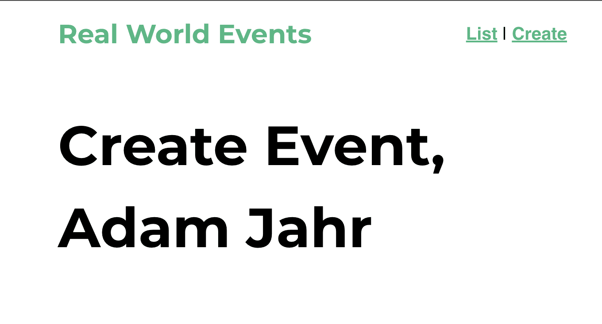

<link rel="stylesheet" href="assets/style.css" type="text/css" />
# State 與 Getter

在這個章節中我們可以對 Vuex 如何運作有個概觀。可以學到要怎麼從 Vuex store，從組件存取 State，兩者都直接藉由 **Getters** 的幫忙來達成。

## 存取 State

打開 **main.js** 來看看，可以在裡面發現匯入了 Vuex 的 **store** 檔，並且將它提供給 Vue 實體。這是為我們所設定的，因為我們在使用 Vue CLI 建立專案時選擇了安裝 Vuex。

```javascript
    import store from './store' 
    
    new Vue({
      router,
      store, // <-- injecting the store for global access
      render: h => h(App)
    }).$mount('#app')
```

這段程式碼能夠藉由注入到每個組件將 **store** 成為能在我們的 app 中全域存取的物件。如此一來，任何組件都能藉由 `$store` 存取 **store** 和其上的屬性(諸如 State，Actions，Mutations 以及 Getters)。

現在讓我們加入一些 State 來看看要怎麼從組件中存取。我們可以建立一個 `user` 物件。

```javascript
    state: {
      user: { id: 'abc123', name: 'Adam Jahr' }
    }
```

我們可以從 app 的任何地方存取 `user` State，但因為很快我們就要來建立活動，那時候會需要知道是哪個 user 建立的，所以我們就先來從 **EventCreate.vue** 存取 State。

```javascript
    <template>
      <h1>Create Event, {{ $store.state.user }}</h1>
    </template>
```

這樣寫是可行的，但要注意在瀏覽器中我們如何顯示整個 `user` 物件。我們可以用 `.` 表示法來從 `user` State 指定想要顯示的屬性。以這個例子來看我們只想顯示  `name` 這個屬性。



讚！現在我們可以看到使用者的名字。那如果我們想在組件裡的多個地方用到使用者的名字呢？當然，我們會在所有的地方寫成 `this.$store.state.user.name`... 或者是我們也可以只寫在 `computed` 屬性中，我們把這個屬性叫做 `userName`。

```javascript
    computed: {
      userName() {
        return this.$store.state.user.name
      }
    }
```

這樣寫我們的樣板看起來更乾淨更易讀了。

```html
    <h1>Create an Event, {{ userName }}</h1>
    <p>This event is created by {{ userName }}</p>
```

而且如果我們需要在我們的組件中的方法裡面用到它時，就可以很簡單的寫成 `this.userName`。

## `mapState` 小幫手(Helper)

如果我們需要在同一個組件存取 State 的不同部分的話，情況可能會變得很冗長，又要反覆的為每個屬性增加 `computed` 屬性。為了要簡化這樣的工作，我們可以利用 `mapState` 小幫手的功能，它可以為我們生成 `computed` 屬性。

我們先來增加更多的 State 到 Vuex Store 裡，這樣比較容易看出來。先來增加一個活動類型的陣列：

```javascript
    state: {
      user: { id: 'abc123', name: 'Adam Jahr' },
      categories: ['sustainability', 'nature', 'animal welfare', 'housing', 'education', 'food', 'community']
    }
```

現在在 **EventCreate.vue**，我們來 import `mapState`

```javascript
  import { mapState } from 'vuex'
```

然後使用它來將 State 映射到 `computed` 屬性，如此就可以取得使用者的 名字和活動類別。

```javascript
    computed: mapState({
      userName: state => state.user.name,
      categories: state => state.categories
    })
```

這邊可以注意一下我們是怎麼使用箭號函式取得 `state` 物件並回傳想要的屬性，`state.user.name` 以及 `state.categories`

如果我們存取的是最上層的 State（不使用`.`表示法往下取得屬性），我們可以使用更簡化的寫法，如下：

```javascript
    computed: mapState({
      userName: state => state.user.name,
      categories: 'categories' // <-- simplified syntax for top-level State
    })
```

這邊可以再注意一下我們得用字串的 `'categories'`。這個字串的效果就和 `state => state.categories` 相同。

我們還可以更進一步簡化 `mapState` 的語法，那就是直接傳一個我們想要映射 State 物件的字串陣列，像這樣：

```javascript
  computed: mapState(['categories', 'user'])
```

當然啦，在簡化 `mapState` 寫法之後，我們的樣板裡面只要用 `.` 表示法存取使用者名字就可以了。

```html
  <h1>Create am Event, {{ user.name }}</h1>
```

## 物件延展運算子(Object Spread Operator)

你現在可能已經注意到了，`mapState` 回傳一個有 **computed** 屬性的物件。但是這樣我們就無法增加額外的屬性，像是本地使用的 computed 屬性就無法被加入。

為了解決這個問題我們可以利用*物件延展運算子*，它允許我們將額外的 computed 屬性混合進來。

```javascript
    computed: {
      localComputed() {
        return something
      },
      ...mapState(['categories', 'user']) // <-- using object spread operator
    }
``` 

## Getters

雖然我們可以直接存取 Store 的 State，但有時我們還是會想要存取它衍生的 State。換句話說就是我們可能想要在存取時再對 state *加工*一下。

舉例來說，我們可能想要知道有多少 `categories` 而不是存取 `categories` 這個 State。也就是說我們可能想要知道 `categories` 陣列的長度。

從組件裡面我們可以這樣寫：

```javascript
  this.$store.state.categories.length
```

那如果說有多個組件都需要取得這個數值呢？藉由建立 Vuex 的 Getter，我們就可以避免不必要的重複程式碼。而且同樣的道理，因為 Getter 會被快取，所以使用它也可以是更有效能的選項之一。

我們來試試看把 Getter 加到 Store 裡面。

**store.js**

```javascript
  catLength: state => {
    return state.categories.length
  }
```

從上面的程式碼我們可以了解，Getter 都是帶入 `state` 當作參數的函式，並且允許回傳加工或篩選過的 state。

------------------

### 使用 Getter

現在我們來把 `catLength` 這個 Getter 用在我們的 **EventCreate** 組件中。就和存取 State 的方法一樣，我們會把它放在 `computed` 的屬性裡面。

```javascript
  computed: {
    catLength() {
      return this.$store.getters.catLength
    }
  }
```

如果在任何時間點，`categories` State 陣列的長度改變的時候，`catLength` Getter 會被重新計算，我們的 `computed` 屬性內容也就跟著更新了。

---------------------

### 傳遞 Getter 到 Getter

如果我們想要取得的 state 是要跟另一個 Getter 一起加工才能得到的話，我們可以傳入 `getters` 當作 Getter 的第二個參數。這樣我們就可以在這個 Getter 裡面存取其他 Getter 的內容。

舉個簡單的栗子，好比說在 State 中我們有個 todos 的陣列：

```javascript
    todos: [
          { id: 1, text: '...', done: true },
          { id: 2, text: '...', done: false },
          { id: 3, text: '...', done: true },
          { id: 4, text: '...', done: false }
        ]
```

我們可能會建立一個 Getter 去取得那些標示為 `done` 的 todo。

```javascript
  doneTodos: (state) => {
    return state.todos.filter(todo => todo.done)
  }
```

然後如果在我們想找出還有多少待完成的 todo時，我們就可以在另一個 Getter 中使用 `doneTodos` 這個 Getter。

```javascript
  activeTodosCount: (state, getters) => {
    return state.todos.length - getters.doneTodos.length
  }
```

這樣我們就能透過上面 `activeTodosCount` Getter 知道有多少未完成的 todos。

你可能會疑惑，為什麼我們不直接寫個像下面這樣的 `activeTodos` 的 Getter？

```javascript
  activeTodosCount: (state) => {
    return state.todos.filter(todo => !todo.done).length
  }
```

其實這樣寫也是可以的，但我們那樣寫是為了要展示如何在 Getter 傳入 `getters` 並且使用它。

## 動態的 Getter

學到現在，我們可能會想是不是有機會可以使用動態的 Getter。換言之就是可以基於參數取得某個 state。答案是可以的，我們可以藉由回傳一個函式來達成這個目的。

舉個栗子，假如我們有一個活動陣列，我們可以像下面的程式碼這樣利用 `id` 取得活動：

```javascript
  getEventById: (state) => (id) => {
    return state.events.find(event => event.id === id)
  }
```

接著在組件的 `computed` 屬性裡面，就可以這樣寫：

```javascript
  computed: {
    getEvent() {
      return this.$store.getters.getEventById
    }
  }
```

在樣板裡面就可以傳遞參數來取得特定的活動：

```javascript
  <p>{{ getEvent(1) }}</p>
```

在這邊要注意一下，像這樣的動態 Getter 每次呼叫都會執行，而且結果是不會被快取住的。

## `mapGetters` 小幫手

和存取 State 的概念一樣，我們也可以在組件裡面搭配 `mapGetters` 小幫手映射 Getter 到 `computed` 屬性。

首先我們要先把它 `import` 進來：

```javascript
  import { mapGetters } from 'vuex'
```

然後就可以這樣用：

```javascript
  computed: mapGetters([
    'categoriesLength',
    'getEventById'
  ])
```

這樣子在組件中就有個映射到 Getter 的 `computed` 屬性的陣列。

如果想要更改 Getter 的名字，可以像下面這樣👇：

```javascript
  computed: mapGetters([
    catCount: 'categoriesLength',
    getEvent: 'getEventById'
  ])
```

這樣寫的話，`this.catCount` 會映射到 `this.$store.getters.categoriesLength` 而 `getEvent` 會映射到 `this.$store.getters.getEventById`。

### 物件延展運算子(Object Spread Operator)

和 `mapState` 的概念相同，如果想要混合本地的 `computed` 屬性，或 `mapState` 屬性時，我們就需要用到物件延展運算子。

```javascript
  computed: {
    localComputed() { return something },
    ...mapGetters({
      catCount: 'categoriesLength',
      getEvent: 'getEventById'
    })
  }
```