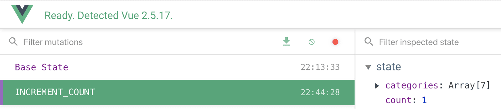

<link rel="stylesheet" href="assets/style.css" type="text/css" />
# Mutation 與 Action - 單元一

現在我們學會了要怎麼存取 Vuex State，可以開始來把應用程式的資料儲存在裡面了。要做就要利用 Mutation 來把資料寫入 state。在這個章節裡我們要來介紹 Mutation，然後再了解如何將 Mutation 打包到 Action 裡面讓我們的 state 能保持未來的擴充性。

## Mutation

在[Vuex 介紹](1.-intro-to-vuex.md)那個章節，我們介紹過了可以利用 Mutation 來更新或 mutate 我們的 State 內容。

舉個栗子，我們的 State 裡面有個 `count` 屬性：

**store.js**

```javascript
  state: {
    count: 0
  }
```

現在在 state 下，我們可以寫一個 mutation 來增加它的數值。

**store.js**

```javascript
  mutations: {
    INCREMENT_COUNT(state) {
      state.count += 1
    }
  }
```

如上面的程式碼，`INCREMENT_COUNT` 這個 mutation 將我們的 Vuex 當作參數並且利用它來增加 `count` 的數值。

現在我們來試試看在組件中 *commit* 這個 Mutation。在 **EventCreate** 組件裡面，我們會增加一個方法：

```javascript
  incrementCount() {
    this.$store.commit('INCREMENT_COUNT')
  }
```

這邊我們的 `incrementCount` 方法只是很單純的 commit `INCREMENT_COUNT` 這個從 `this.$store` 取得的 Mutation。

如果再增加一個 button 的話，我們可以點擊它來觸發 Mutation。

```html
  <button @click="incrementCount">Increment</button>
```

檢查 Vue DevTools 我們可以看到 `count` 在 Vuex tab 顯示的內容被更新了。



同樣的，注意我們的 Mutation 也被 log 到 DevTools 裡面了。假如我們點擊 **Base State**，我們可以看到 Mutation 被 commit 之前的 State，也就是說 `count` 值倒轉為 0 了。

這個工具讓我們可以做到 "除錯的時間旅行"，如此我們能夠看到 State 在指定時間點時的內容，而且我們也能了解 Mutation 如何影響我們的 State。

### 為何 Mutation 名稱都是大寫：

如果你疑惑為何所有的 Mutation 名稱都是大寫字母，那是因為在一般 Flux-based 模式會把它們的名稱都宣告為大寫字母。

這樣的作法完全不強制的，而且也會常看到 Mutation 以駝峰表示法命名的例子。全部大寫的確使得在看檔案內容的時候更直接清楚有哪些可用的 Mutation。而且在 Mutation vs Action，Getter 等等情形，全大寫讓你更容易分辨 commit 的是 Mutation。

## 動態 Mutation

現在我們對 `count` 一次只增加 1。那如果我們想要一次增加一個不固定的數值的話呢？我們可以傳給 Mutation 一個酬載(payload)來讓它動態修改。

我們來在樣板裡面增加一個 `input` 標籤，然後利用 `v-model` 綁定到一個新增的 `data` 屬性 `incrementBy` 來做這個練習。

```html
  <input type="number" v-model.number="incrementBy" />
```

這邊注意一下我們使用 `.number` 裝飾子(modifier)來將輸入值轉為數字型別。

```javascript
  data() {
    return {
      incrementBy: 1
    }  
  }
```

然後我們在 commit Mutation 的時候把 `data` 裡面的 `incrementBy` 當作酬載傳入。

```javascript
  incrementCount() {
    this.$store.commit('INCREMENT_COUNT', this.incrementBy)
  },
```

在 Vuex Store 中，`INCREMENT_COUNT` 能夠接收 commit 的第二個引數當作酬載(payload)，並利用它來動態更新 `count` 的數值。

```javascript
  INCREMENT_COUNT(state, value) {
    state.count += value
  }
```

如此以來在 `input` 控制項輸入的值就能被用來更新 `count` State 值了。

## Actions

因為 Vuex Mutation 是同步的，意思是會一個完成後才會執行下一個，而 Action 是非同步的。他們可以包含多個步驟，而且實際執行的時候跟你當初寫的順序不同。如果你還記得前面章節有關 API 的呼叫方法的話，Axios 函式就是非同步的。

我們可以利用 Action 來將 Mutation 或數個 Mutation 打包商業邏輯。

在我們前面介紹 Vuex 的課程中，初步了解到 Action 要如何被寫入設定 `isLoading` state 為 true 的 commit Mutation，然後進行 API 呼叫。而在 response 回傳時，在 commit Mutation 以 response 設定 `todos` State 之前先 commit Mutation 設定`isLoading` State 為 false。


理解 Action 中的 Mutation 不一定會被 commit 是很重要的，這取決於周邊邏輯和環境是如何執行的。

舉個現實生活中的栗子，如果我請我的朋友從麵包店幫我帶點麵包回來，這邊的 Mutation 會是 **PICK_UP_BREAD**，而 Action 差不多會是 **pleasePickUpBread**。在請求別人去做某件事和他們真的會去做之間有很大的差別。

可以有很多為什麼他不能 commit Mutation 的理由。比如說他的車子在去麵包店的途中拋錨了，或者是麵包店的麵包賣完了等等...。所有 Action 就好像是在表達對發生某件事的意圖或慾望，為了對 state 做出某種改變，是否會完成還要依靠周邊環境的配合。

現在我們來看看 Action 的實作。

## 

回到計數器的栗子，如果我們只想要在 app 有 `user` 的時候更新 `count`，可以像下面👇這樣寫：

```javascript
  actions: {
    updateCount({ state, commit }, incrementBy) {
      if (state.user) {
        commit('INCREMENT_COUNT', incrementBy)
      }
    }
  }
```

上面👆的程式碼做了些什麼呢？

我們建立了一個叫 `updateCount` 的 Action。它用到了[物件解構](https://developer.mozilla.org/en-US/docs/Web/JavaScript/Reference/Operators/Destructuring_assignment#Object_destructuring) 的方式從 Vuex 的框架(context)物件 `{ state, commit }`取得 `state` 和 `commit`。

這個框架物件是任何 Action 的第一個引數，而且它和在 store 實體揭露的是同一組屬性 (state, mutations, actions, getters)。因此你可以藉由呼叫 `context.commit` 來 commit 一個 mutation 或者像是 `context.state.count` 來取得 `count` State 的值。

另外，`updateCount` 會帶入 `value` 這個酬載。

```javascript
  ({ state, commit }, value)
```

所謂酬載就是所有 Action 的第二個引數。

我們這個 Action 會檢查 `user` 是不是存在 State 裡面。如果有的話，就會 *commit* `INCREMENT_COUNT` 這個 Mutation，然後把 `incrementBy` 的值當作酬載傳入。如果 `user` 不存在，則這個 Mutation 就不會被 commit。

現在在我們的組件裡面，我們回來 *dispatch* `updateCount` 這個 Action，而這個 Action 會視條件 commit Mutation。

```javascript
  incrementCount() {
    this.$store.dispatch('updateCount', this.incrementBy)
  },
```

很重要而且特別要記住的是，強烈建議**永遠要從 Action 裡面去 commit Mutaion**。如果你的 Mutaion 目前不需要任何商業邏輯，這樣做看起來好像是在寫不必要的程式碼，但是這樣做在未來絕對會對你的 app 的擴充性是更有幫助的。在一開始就這樣寫絕對比未來有需要的時候再從你的 app 裡面重構一堆程式簡單的多了。

現在我們知道要怎麼 commit Mutation，然後把它們包在 Action 裡面了，那麼就來把它放到我們的範例 app 囉。

## 加到範例 App

目前在我們的 app 裡面，只是從模擬 API 把活動抓下來。但是我們還希望使用者能夠自己建立新的活動，這些活動是被新增或是說儲存在 Vuex store 裡面。所有我們會增加一個 Mutation 並且在 Action 裡面 commit 它。

不過首先，我們要先來安裝新的相依函式庫。

## 安裝 Date Picker

我們即將建置一個用來建立新活動的表單。但是我們需要一個給表單使用的日期挑選器，所有我們可以來下載一個熱門的外部函式：[vuejs-datepicker](https://github.com/charliekassel/vuejs-datepicker)。

從終端機的命令列輸入：`npm install vuejs-datepicker --save` 來安裝。

函式庫裝好後就可以在專案裡面使用它了。

## 建立活動

讓我們回到 **EventCreate** 組件，因為就跟它的名字一樣，我們會使用它來建立新的活動。就跟我們之前有一個 input 控制項，然後我們用 `v-model` 把它的值綁定到 `data`，然後有另一個 button 控制項來 commit Mutation 一樣，我們會用概念相同但更延伸的版本來處理，利用一個表單收集資料這樣使用者就能夠建立新的活動。

下面👇是我們表單的樣板，你可以注意到我們已經使用新增的 `datepicker` 函式庫了。

```html
        <form>
          <label>Select a category</label>
          <select v-model="event.category">
            <option v-for="cat in categories" :key="cat">{{ cat }}</option>
          </select>
          <h3>Name & describe your event</h3>
          <div class="field">
            <label>Title</label>
            <input v-model="event.title" type="text" placeholder="Add an event title"/>
          </div>
          <div class="field">
            <label>Description</label>
            <input v-model="event.description" type="text" placeholder="Add a description"/>
          </div>
          <h3>Where is your event?</h3>
          <div class="field">
            <label>Location</label>
            <input v-model="event.location" type="text" placeholder="Add a location"/>
          </div>
          <h3>When is your event?</h3>
          <div class="field">
            <label>Date</label>
            <datepicker v-model="event.date" placeholder="Select a date"/>
          </div>
          <div class="field">
            <label>Select a time</label>
            <select v-model="event.time">
              <option v-for="time in times" :key="time">{{ time }}</option>
            </select>
          </div>
          <input type="submit" class="button -fill-gradient" value="Submit"/>
        </form>
```

如你所見，我們詢問使用這一系列的問題，然後把他的回答在 input 控制項上利用 `v-model` 綁定到我們的 `data` 屬性。

讓我們一起來看看組件的 `script` 去看，然後一步步的解釋。

```javascipt
  <script>
    import Datepicker from 'vuejs-datepicker'
    export default {
      components: {
        Datepicker
      },
      data() {
        const times = []
        for (let i=1; i<= 24; i++) {
          times.push(i + ':00')
        }
        return {
          event: this.createFreshEvent(),
          times,
          categories: this.$store.state.categories
        }
      },
      methods: {
        createFreshEvent() {
          const user = this.$store.state.user
          const id = Math.floor(Math.random() * 10000000)
          return {
            id: id,
            category: '',
            organizer: user,
            title: '',
            description: '',
            location: '',
            date: '',
            time: '',
            attendees: []
          }
        }
      }
    }
  </script>
```

現在來拆解這坨程式碼。

```javascript
  import Datepicker from 'vuejs-datepicker'
  export default {
    components: {
      Datepicker
    }
```

在程式頂端，我們匯入新的 `datepicker` 函式庫，並且將它註冊為子組件，這樣我們就可以在樣板裡面使用它。

```javascript
  data() {
    const times = []
    for (let i = 1; i <= 24; i++) {
      times.push(i + ':00')
    }
    return {
      ...
      times
    }
```

接著在 `data` 中，我們用了點簡單演算法來產生時間的陣列到 `times` 裡面。這邊注意一下，`data` 裡面的 `times` 屬性寫法和 `{ times: times }` 相同，就是當 key 跟 valve 的名稱一樣時可以簡化成前面的寫法。如果你覺得這邊的邏輯怪怪的，記得 `data()` 是一個函式，所以在裡面處理一下資料初始化的邏輯是非常可行的。

```html
  <select v-model="event.time">
    <option v-for="time in times" :key="time">
      {{ time }}
    </option>
  </select>
```

在樣板這邊我們利用 `v-for` 來跑一遍 `times` 陣列。

現在來看看其餘在 `data` 裡面的屬性。

```javascript
  return {
    event: this.createFreshEventObject(),
    categories: this.$store.state.categories,
    times
  }
```

在這邊我們直接從 Vuex Store 裡面獲取 `categories` 然後在 `option` 元素上利用 `v-for` 跑過一遍所有 `categories` 內容。但是我們對 `event` 做了一件特別的事。

```javascript
  event: this.createFreshEventObject(),
```

我們並沒有直接在 `event` 屬性後面放一個活動物件，取而代之的是每當組件被建立時，我們呼叫一個會產生新活動的方法來取得活動物件。

這個方法看起來下面👇這樣：

```javascript
  createFreshEventObject() {
    const user = this.$store.state.user
    const id = Math.floor(Math.random() * 10000000)
    return {
      id: id,
      category: '',
      organizer: user,
      title: '',
      description: '',
      location: '',
      date: '',
      time: '',
      attendees: []
    }
  }
```

在這塊程式碼中，我們從 Vuex Store 取得 `user`，然後回傳一個包含所有我們想收集的資料的物件，其中包含我們的 `user` state。我們也再用亂數建了一個 `id` 常數，然後設定給活動的 `id` 屬性。

這是你可能會疑惑，為什麼要用這個方法來得到新的活動物件，為什麼不要直接在 `data` 裡面的做過活動的屬性？很好，因為在建立完新活動後我們要重置組件的活動資料，利用這個方法就很方便。待會可以看到使用的情形。

假如我們沒有重置本地的活動物件，我們可能會在這個物件和推回 State 的物件之間留下不必要的連結。

>自己的理解：
>每次要求的時候就建立一個全新的活動物件，在管理上省去很多不必要的麻煩

最後我們只需再加上簡單的範圍樣式：

```css
  .field {
    margin-bottom: 24px;
  }
```

## ADD_EVENT Mutation

我們現在要來在 Vuex Store 加入 `ADD_EVENT` Mutation。

```javascript
  ADD_EVENT(state, event) {
    state.events.push(event)
  }
```

這個 Mutation 接受一個 `event` 當作引數然後把它推到 `events` 陣列 state 裡面。

## createEvent Action

我們現在想把 `ADD_EVENT` Mutation 包到 `createEvent` 這個 Action 裡面。
但是首先需要先匯入 **EventService.js** 檔到 **store.js** 裡面。

```javascript
  import EventService from '@/services/EventService.js'
```

因為我們會在 Action 裡面用到它：

```javascript
  createEvent({ commitm }, event) {
    EventService.postEvent(event)
    commit('ADD_EVENT', event)
  })
```

正如你所見，新建立的 Action 利用了 `EventService` 進行 **POST** 請求 `postEvent(event)`，在這個範例 app 中，它會在 本地的 `db.json` 檔新增一個活動物件。

來看看 **EventService** 裡面這個 **POST** 請求：

**EventService.js**

```javascript
  postEvent(event) {
    return apiClient.post('/events', event)
  }
```

這個方法會接收一個活動當引數然後 POST 到 API 的端點來模擬寫入資料庫。

然後 `createEvent` Action 就會 *commit* `ADD_EVENT` Mutation，這樣就會立刻把剛剛才新增到資料庫的活動也加入我們本地的 `events` State。以防待會 UI 就會用到這個剛新增的 `event` state。

## Dispatch eventCreate Action

回到 **EventCreate** 組件，我們現在可以在裡面增加一個新的會 *dispatch* 新建立 Action 的方法。

```javascript
  methods: {
    createEvent() {
      this.$store.dispatch('createEvent', this.event)
    }
  }
```

我們會在表單提交時用下面的方式來觸發這個方法：

```html
  <form @submit.prevent="createEvent">
```

## 重置活動資料

之前我們有提到會在每次新活動提交之後重置組件的活動物件，我們會用下面這樣的方式來做：

```javascript
  createEvent() {
    this.$store.dispatch('createEvent', this.event)
    this.event = this.createFreshEventObject()
  }
```

**問題：**在我們確認活動被加入後端之前我們還不想清除活動資料。如果使用者建立一個新活動，點擊提交然後走進電梯結果這個活動就提交不到後端。這樣他們就要整個重新建立一遍，因為活動已經被重置了。

**解法：**在我們的 Action 裡面，我們可以從 API `return` response。接著在 `.then` commit Mutation。

```javascript
  createEvent({ commit }, event) {
    return EventService.postEvent(event).then( () => {
      commit('ADD_EVENT', event.data)
    })
  }
```

改成這樣之後，當活動物件成功 POST 到 API 時，我們再來 *commit* `ADD_EVENT`。而且我們甚至可以等 response 回傳到 **EventCreate** 組件，就像下面的程式碼：

```javascript
  createEvent() {
    this.$store.dispatch('createEvent', this.event)
    .then(() => {
      this.event = this.createFreshEventObject()
      })
      .catch(() => {
        console.log('There was a problem creating your event.')
      })
  }
```

👆的程式碼來看，我們便只會在活動資料(`this.event`)成功 POST 後才重置。

如果 POST 失敗，也會把錯誤 log 到 console。在後面的章節會再說明要怎樣有效的把錯誤顯示給使用者看。

## 路由到新建立的活動頁面

一旦我們成功建立新的活動後，接下來就會想看看我們新增的活動內容。換句話說就是把頁面導到 **event-show** 頁面來看看我們剛剛新增好的活動。

我們可以使用 [router.push](https://router.vuejs.org/guide/essentials/navigation.html#router-push-location-oncomplete-onabort) 方法來完成這個功能，然後將 `id` 參數設定為我們剛剛建立好 `this.event` 的 id。

```javascript
  createEvent() {
    this.$store
      .dispatch('createEvent', this.event)
      .then(() => {
        this.$router.push({
          name: 'event-show',
          params: { id: this.event.id }
        })
        this.event = this.createFreshEventObject()
      })
      .catch(() => {
        console.log('There was a problem creating your event.'
      })
  }
```

我們只需要確定在除去 `id` **之後**去對路由參數重置活動，記住是**之後**，否則 `this.event` 就會變成 `undefined`。

## 調整 EventShow

現在我們只需要調整 **EventShow** 組件的樣板，讓它不會在活動策劃人欄位中顯示整個使用者物件。

現在我們要使用 `.` 表示法來顯示 `event.organizer.name` 然後用三元運算子來避免在組件取得資料前就進行渲染而造成 `name is undefined` 的錯誤。

```html
  <spam class="badge -fill-gradient">{{ event.attendees ? event.attendees.length : 0 }}</span>
```

我們來顯示活動策劃人的名字：

```html
  <h5>
    Organized by {{ event.organizer ? event.organizer.name : '' }}
  </h5>
```

## 下一步是？

接下來我們會繼續學習有關 Mutation 和 Action，以及要怎麼有效率的用它來從 API 抓取活動資料。


