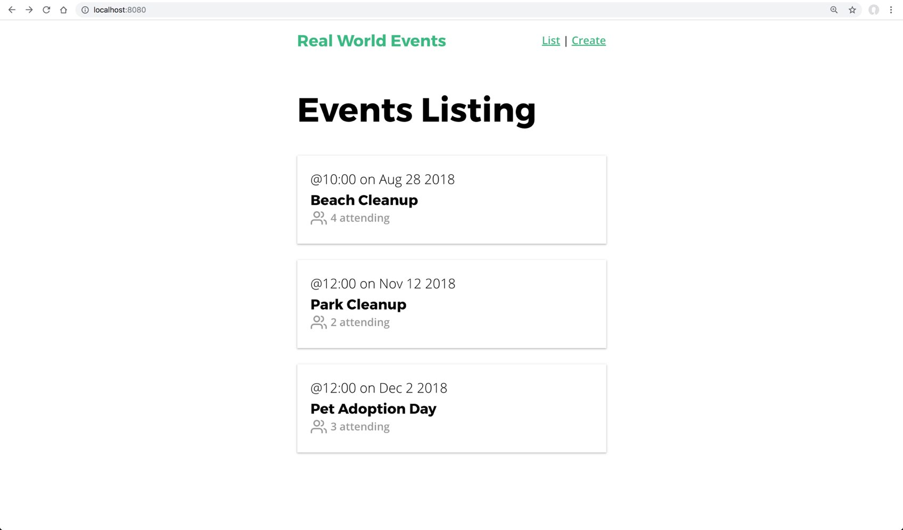
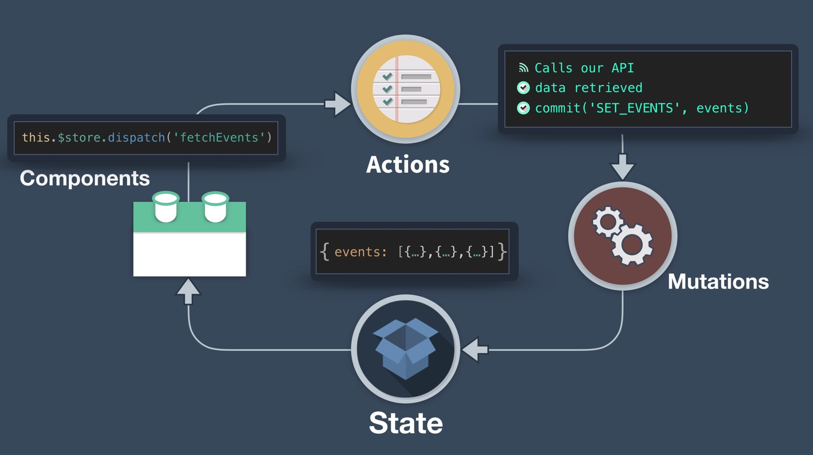
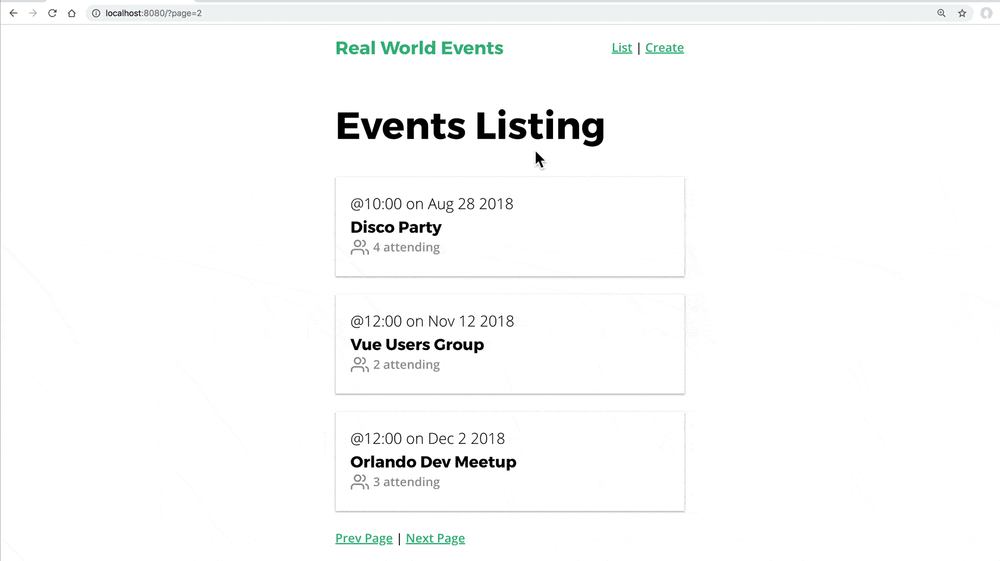
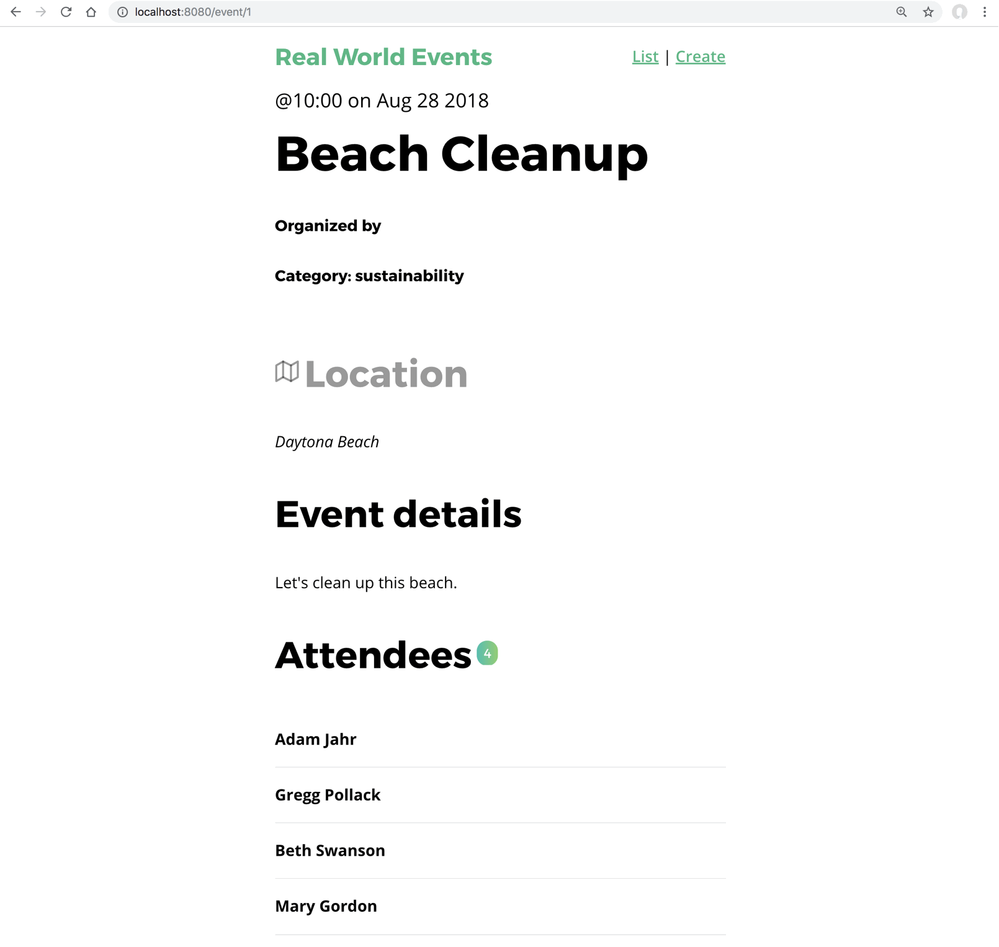

<link rel="stylesheet" href="assets/style.css" type="text/css" />
# Mutation 與 Action - 單元二

在[上一個章節](4.-mutations-and-actions-pt1.md)我們學到了要如何搭配 API 開始建立 Vuex Action 及 Mutation，像這樣的情況在實際開發應用程式時是常常會發生的。在這個章節我們將會為我們的 **EventList** 和 **EventShow** 頁面建立 Vuex Action 及 Mutation，進而再實作分頁的功能。

## 🛑 問題：使用 Vuex 載入 EventList

我們在之前使用 Axios 建立了 **EventService**，其中有一個 `getEvents` 的方法，在 **EventList** 組件建立起來的時候我們利用它來取得活動內容。這個組件現在看起來像這樣👇：

📃 **/views/EventList.vue**

```vue
  <template>
    <div>
      <h1>Events Listing</h1>
      <EventCard v-for="event in events"
                 :key="event.id"
                 :event="event" />
    </div>
  </template>
  <script>
    import EventCard from '@/components/EventCard.vue'
    import EventService from '@/services/EventService.js'
    
    export default {
      components: {
        EventCard
      },
      data() {
        return {
          events: []
        }
      },
      created() {
        EventService.getEvents()
          .then(response => {
            this.events = response.data
          })
          .catch(error => {
            console.log('There was an error:', error.response)
          })
      }
    }
  </script>
```

然後在瀏覽器看起來會是這樣：



我們想要這樣的組件能夠適當地利用 Vuex 來擷取及顯示活動。

## ☑️ 解決方案

在這個組件使用 Vuex 的第一步就是建立新的 Mutation 和 Action。下面是展示我們想在 **EventList** 組件裡面發生的流程👇：



在 Vuex State 裡面我們已經有了 `events:[]` 這個 State，而且我們也已經匯入 **EventService**，所有現在 **store.js** 裡面會變成這樣👇：

📃 **/store.js**

```javascript
  state: {
    ...
    events: [] // 已經存在了
  },
  mutations: {
    ...
    SET_EVENTS(state, events) {
      state.events = events
    }
  },
  actions: {
    ...
    fetchEvents({ commit }) {
      EventService.getEvents()
        .then(response => {
          commit('SET_EVENTS', response.data
        })
        .catch(error => {
          console.log('There was an error:', error.response)
        })
    }
  }
```

請注意，我們的 `SET_EVENTS` Mutation 設定全部的活動，而 `fetchEvents` Action 則是簡單的呼叫 EventService 然後再呼叫 Mutation。

再回到我們的 **EventList.vue** 組件，我們會在裡面做一籮筐的小修改。

📃 **/views/EventList.vue**

```vue
  <script>
    import EventCard from '@/components/EventCard.vue'
    import { mapState } from 'vuex'
    
    export default {
      components: {
        EventCard
      },
      created() {
        this.$store.dispatch('fetchEvents')
      },
      computed: mapState(['events'])
    }
  </script>
```

👆這邊匯入了 `mapState` 小幫手，然後移除匯入 EventService 那一行以及 `data` 屬性是。我們的 `created` 生命週期鉤子(lifecycle hook)呼叫新建好的 Action。現在回到瀏覽器看的話，可以看到活動列表，就跟還沒更改之前看起來一樣。

## 🛑 問題：分頁

在 app 中顯示列表資料時，像是這邊的活動列表，我們常常會有可能有千百筆的活動要顯示，像這樣的情形要一次全抓下來的話可能會有點問題（資料量太大而且可能導致拖慢瀏覽器的速度）。因此我們需要像是 Google 搜尋結果那樣的分頁功能。因為我們打算打造的是真實世界的應用程式，所有讓我們來試試看實作分頁功能吧。

## ☑️ 解決方案

首先要注意到的地方是其實我們可靠的 `json-server` 其實已經內建 [API 分頁功能](https://github.com/typicode/json-server#paginate)。加入我們送出 `_limit` 參數就可以限制每頁回傳的活動筆數，再加上 `_page` 參數就會只回傳指定頁面的資料。是不是很完美！👍

所以如果我們嘗試建構像是 `/events?_limits=3&_page=2` 的 URL，我們的 API 就會回傳每頁 3 筆活動資料，而且是第二頁的資料。首先讓我們先來修改 **EventService** 的 `getEvents` 方法，增加兩個新的傳入引數。

📃 **/services/EventService.js**

```javascript
  getEvents(perPage, page) {
    return apiClient.get('/events?_limit=' + perPage + '&_page=' + page)
  }
```

然後在 Vuex，再改一下 Action：

📃 **/store.js**

```javascript
  actions: {
    ...
    fetchEvents({ commit }, { perPage, page }) {
      EventService.getEvents(perPage, page)
        .then(response => {
          commit('SET_EVENTS', response.data)
        })
        .catch(error => {
          console.log('There was an error:' + error.response)
        })
    }
  }
```

👆注意我們 `fetchEvents` Action 的第二個引數是用 ES2015 的[解構賦值](https://developer.mozilla.org/zh-TW/docs/Web/JavaScript/Reference/Operators/Destructuring_assignment)抓出 `{perPAge, page }`。因為 Mutation 和 Action 的第二個引數都是有效的 `payload`酬載。而這個 `payload` 可以是單一的變數或是單一的物件。

那麼，要從 **EventList.vue** 呼叫它的話，我們要這樣做👇：

```vue
  ...
  <script>
    import EventCard from '@/components/EventCard.vue'
    import { mapState } from 'vuex'
    
    export default {
      components: {
        EventCard
      },
      created() {
        this.$store.dispatch('fetchEvents', {
          perPage: 3, // <-- 每頁要顯示多少活動
          page: this.page // <-- 我們要瀏覽第幾頁
        })
      },
      computed: {
        page() { // 我們現在在第幾頁
          return parseInt(this.$route.query.page) || 1
        },
        ...mapState(['events'])
      }
    }
  </script>
```

這邊要注意我們建立了一個新的 `computed` 屬性，`page()`。它會進到目前的 URL，檢查我們是不是有個叫 page 的參數，如果沒有的話就假設我們現在在第一頁。所以加入目前的 URL 是：`http://localhost:8080/?page=2` 然後 `this.$route.query.page` 就會是 `2`。我們在 `page`上的查詢參數呼叫 `parseInt` 以確保資料是數字格式。

注意到我們給 Action 的酬載是 `{ perPage: 3, page: this.page }`。

最後，我們來在相同的檔案樣板👇

📃 **/views/EventList.vue**

```vue
  <template>
    <div>
      <EventCard 
        v-for="event in events" 
        :key="event.id"
        :event="event" />
      <template v-if="page != 1">
        <router-link
          :to="{ name: 'event-list', query: { page: page - 1 } }"
          rel="prev">Prev Page</router-link>
      </template>
      <router-link
        :to="{ name: 'event-list', query: { page: page + 1 } }">Next Page</router-link>
    </div>
  </template>
```

樣板這邊加入了分頁的連結，我們可以在 **db.json** 增加多一點資料來試試看分頁效果，像👇這樣：


看起來在第一頁我們看到頁面只顯示我們設定的筆數限制。看起來好像成功了，但是但我們連到下一頁的時候畫面都沒變，要重新整理畫面的時候才會更新。

## 🛑 問題：組件沒有重新載入資料

這邊的問題在於 router 認為我們在載入相同的 'event-list' 名稱路由，所有不會重新載入組件。這就像是點擊兩次相同連結一樣，當使用者點擊兩次相同連結，而且瀏覽器已經在那個頁面上時，我們會希望重新載入組件嗎？答案是**不會**，所以才會有現在這個情形。`created()` 不會在連到第二頁的時候再次被呼叫，也是因為組件不會被重新載入。

身為一個 Vue 開發人，這是無可避免的情形：在查詢參數改變的時候重新載入組件。

## ☑️ 解決方案：更新路由視圖

有兩個方式可以解決這個問題：

1. 監看 `page` 這個 `computed` 屬性，當它的值改變時 dispatch `fetchEvent` 這個 action。
2. 當*完整* URL 發生改變時，告訴 `router` 重新載入組件，所謂完整 URL 就包含了跟在後面的查詢參數。我們會用這個解法，因為它超簡單。

📃 **/App.vue**

```vue
  <template>
    <div id="app">
      <NavBar />
      <router-view :key="$route.fullPath" />
    </div>
  </template>
```

在 router-view 加上 key 屬性後，一切就變得正常了。



## 🎓 額外獎勵

在現在的版本我們可以發現 "Next Page" 連結不會在我們瀏覽到最後一頁的時候消失，所以造成會連到一個空白頁面，很明顯的我們不想發生這樣的結果。所以我們可以來嘗試解決這個問題，就當作是額外獎勵吧！

有很多方式可以解決這個問題。如果我們知道總共有多少筆活動資料的話會比較簡單。**json-server** 其實在每次請求資料的時候都把它放在 header 上面了。我們可以從 Chrome DevTools -> Network tab 看到他，我們可以看到：

### x-total-count: 10

就是它！突破盲腸。所以我們就可以從 `fetchEvents` Action 裡面再來抓這個資訊。

📃 **/store.js**

```javascript
  fetchEvents({ commit }, { perPage, page }) {
    EventService.getEvents(perPage, page)
      .then( response => {
        console.log('Total events are ' + response.headers['x-total-count'])
        commit('SET_EVENTS', response.data)
  })
```

看到 console.log 的內容了嗎？這邊你可能會想要建立一個 `eventsTotal` 的 Vuex State，然後再為它建立 Mutation 和 Action，從 `getEvents` 裡面呼叫 Mutation，然後再從 `EventList.vue` 抓出來檢查 `eventsTotal > (this.page * 3)`。如果為 true 就顯示下一頁，這樣理解？

## ➡️ 關於快取的小筆記

我們程式現在這樣的寫法會在每個頁面呼叫 API。在某些 app，我們可能永遠想要取得最新的資料，這種寫法正是符合這樣的需求。但是如果是要應付幾百萬個使用者的話，我們最好要實作某種快取策略來保持我們頁面的反應速度。不管從Vue 的外部或內部都有很多種方式可以做到。

## 🛑 問題：實作活動顯示頁面

現在我們的分頁功能已經就位了，當使用者點擊一個活動會連到活動顯(**ShowEvent**)示頁面，在 Vuex 裡面我們要做什麼呢？這是目前頁面看起來的樣子👇：



## ☑️ 解決方案

和之前相同，我們先從 Vuex 開始，這次在 State 裡面加入一個叫 `event` 的物件來儲存目前顯示的活動。然後在增加一個 Mutation 來設定它的值以及一個 Action 來呼叫 API。

📃 **/store.js**

```javascript
  export default new Vuex.Store({
    state: {
      ...
      event: {}
    },
    mutations: {
      SET_EVENT(state, event) {
        state.event = event
      }
    },
    actions: {
      ...
      fetchEvent({ commit }, id) {
        EventService.getEvent(id)
          .then(response => {
            commit('SET_EVENT', response.data
          })
          .catch(error => {
            console.log('There was an error:', error.response)
          })
      }
    }
  })
```

然後在我們 **EventShow** 組件，我們會 dispatch `fetchEvent` Action，然後送出 `id` 當作酬載。

📃 **/views/EventShow.vue**

```vue
  ...
  <script>
    import { mapState } from 'vuex'
    
    export default {
      props: ['id'],
      created() {
        this.$store.dispatch('fetchEvent', this.id)
      },
      computed: mapState(['event'])
    }
  </script>
```

👆改成這樣就行了～而且 **EventShow** 頁面看起來和原來一樣，但是內容已經改成 Vuex 囉。

## 🛑 問題：我們載入了資料兩次呀！

我們剛好在 **EventList** 頁面載入所有要顯示的活動資料。如果我們先去瀏覽 **EventList** 頁面，然後再點擊活動進入 **EventShow** 頁面(一般來說很多使用者都會這麼做)，在我們手上已經有資料的時候卻還要再去呼叫 API 取得資料這樣看起來好像很浪費耶。我們該怎麼節省像這樣多餘的 API 呼叫呢？

## ☑️ 解決方案

當我們連到 **ShowEvent** 頁面的時候，我們需要檢查 `events` State 陣列是不是已經有了這個活動了。我們可以利用 **store.js** 裡面已經有的 Getter 來做這件事。我們可以在 `fetchEvent` Action 裡面呼叫它，像是這樣👇：

📃 **/store.js**

```javascript
  ...
  actions: {
    ...
    fetchEvent({ commit, getters }, id) {
    // 除了 commit ，也傳入 getters
      var event = getters.getEventById(id) // 檢查 state 裡面是不是已經有這個活動了。
      
      if (event) { // 找到活動了，commit 它
        commit('SET_EVENT', event)
      } else { // 沒找到才呼叫 API
        EventService.getEvent(id)
          .then(response => {
            commit('SET_EVENT', response.data
          })
          .catch(error => {
            console.log('There was an error:', error.response
          })
      }
    }
  },
  getters: {
    getEventById: state => id => {
      return state.events.find(event => event.id === id)
    }
  }
```

正如👆的程式碼，在 Action 的開頭我們就呼叫 `getters.getEventById(id)` 其中 `id` 是我們想顯示的活動。如果從現行 State 找得到的話我們就 commit Mutation，否則再去從 API 抓。

很明顯地，如果我們想要確認顯示的頁面永遠都是最新的內容，我們會想即使 **EventList** 組件裡面已經有了還是要去呼叫 API。

## ⏪ 摘要

整理一下在這個章節我們學到的重點：

- 如何在 Vuex 抓取單一活動或活動列表。
- 如何用 Vuex 做到分頁功能。
- 如何在 router 裡面使用查詢參數，然後確保組件在參數修改時還是會重新載入。
- 如何最佳化 Vuex State，避免重複載入資料兩次。


