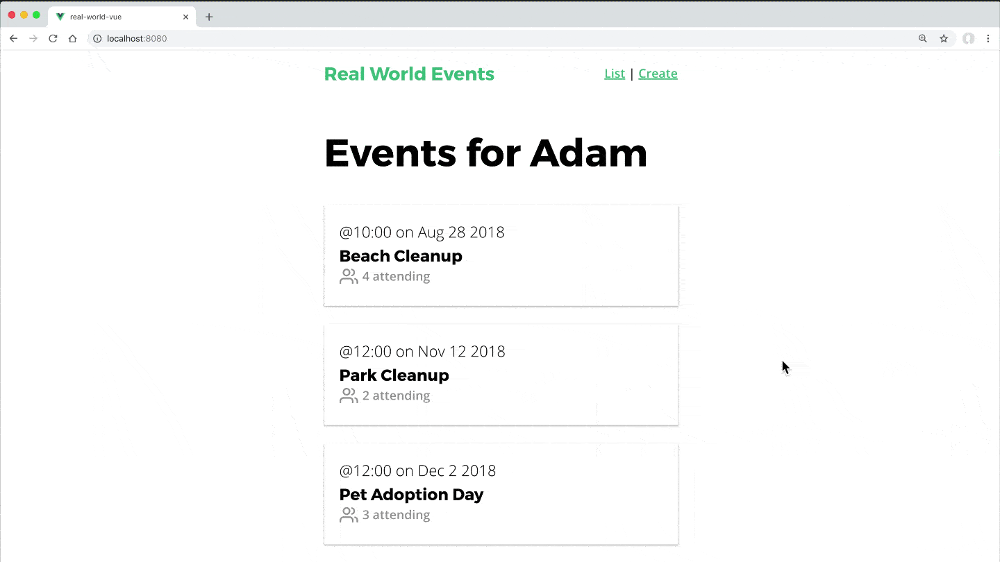

<link rel="stylesheet" href="assets/style.css" type="text/css" />
# 模組

在上兩個章節我們使用 Vuex 封裝應用程式的 state 並且標準化修改 state 的方式(經由 Action 和 Mutation)。但是隨著應用程式漸漸茁壯，我們最終會寫出一個巨大的 `store.js`。這時候就是 Vuex 模組上場的時候了，它能讓我們的 Vuex 程式碼保持整潔而且容易測試。

## 🛑 問題：程式碼該整理一下了

到了現在這個地步，我們必須有更好的方式來整理我們的 Vuex 程式碼，取代全部放在 `store.js` 裡面。

## ☑️ 解決方案

Vuex 有個叫模組的選項，它可以讓我們把程式碼切成不同的檔案。舉例來說，如果我們的應用程式有 `events` 和 `users`，把所有的 State，Mutation 和 Action 全部放在 **/src/store.js** 變成一個大檔案是沒道理的。反之，我們應該把它依功能分解成兩個 Vuex 模組。


在之後，我們的可能會在活動中增加額外如活動留言的功能，以及在使用者可在他們參與的活動上標註"會參加"的功能。這些功能也可以是將其切分為他們自己的 Vuex 模組考量。

我們可以基於資料模型來切分 Vuex 程式碼，或者基於功能來切。其實要怎麼切分實作沒有規定，都是操之在己。

## 👈 回到範例 app

在我們的範例 app，我們可以開始試著建一個 `store` 資料夾，然後把現在的 `store.js` 搬到裡面。這個時候，我們先來修改一下 `main.js`，確認在檔案搬過去之後一切都還能正常運作。

```javascript
  import store from './store'
```

改為：

```javascript
  import store from './store/store'
```

這樣就行了。

## 🏗 建置第一個模組

在我們正式開始建置第一個模組前，我們先來找個地方列印使用者名稱。就決定把他放到首頁的標題上好了。

📃 **/src/views/EventList.vue**

```javascript
  <template>
    <div>
      <h1>Events for {{ user.name }}</h1>
    </div>
    ...
  </template>
  
  <script>
    // 省略程式碼
    ...mapState(['events', 'eventsTotal', 'user'])
  </script>
```

我們並沒有增加新的程式碼，只是想告訴你在 `store.js` 裡面有以下的使用者資料👇：

📃 **/src/store/store.js**

```javascript
  ...
  export default new Vuex.Store({
    state: {
      user: { id: 'abc123', name: 'Young Boy' },
      ...  
```

當我們打開首頁的時候就可以看到使用者的名字顯示在上面。

現在讓我們來建立第一個 **user** 模組，因為將來我們會在範例 app 裡面加入使用者驗證功能，我們會在這邊寫更多的程式碼。所以我們要來建立一個新的 **modules** 資料夾和 **user.js** 檔，裡面只包含 user State。

📃 **/src/store/modules/user.js**

```javascript
  export const state = {
    user: {
      id: 'abc123',
      name: 'Young'
    }
  }
```

現在為了要使用這個模組，我們要把它包含到 **store.js** 裡，就像👇這樣：

📃 **/src/store/store.js**

```javascript
  ...
  import * as user from '@/store/modules/user.js'
  // 這一行會抓出 user.js 裡面全部的常數
  
  Vue.use(Vuex)
  
  export default new Vuex.Store({
    modules: {
      user // 把 user 模組包含進來
    },
    state: {
      categories: [
        'sustainability',
        // ...
    }
  })
```

為了要讓它能夠正常運行，我們要在組件裡面加入另一個 `.user`：

📃 **/src/views/EventList.vue**

```html
  <template>
    <div>
      <h1>Events for {{ user.user.name }}</h1>
    </div>
    ...
  </template>
```

我們要這樣改的原因是因為在模組裡面的 State 是以它的名稱為範圍。待會我們再來介紹，有好幾種方法可以擺脫需要全部改成 `user.user` 的麻煩。

在這之前我發現有個地方的程式碼也要修改才能符合我們新增的 **User 模組**。

📃 **/src/views/EventCreate.vue**

```javascript
  ...
  createFreshEventObject() {
    const user = this.$store.state.user // <----
    const id = Math.floor(Math.random() * 9999999)
  ...
```

在參照 state 的時候好我們要把 `user` 改為 `user.user`，程式碼更新為：

```javascript
  const user = this.$store.state.user.user // <----
```

## 🏗 建立 Event 模組

接下來我們要來把活動的 State，Mutation，Action 和 Getter 全部搬到屬於它自己的 **event.js** 模組裡。大搬家完的程式會像👇：

📃 **/src/store/modules/event.js**

```javascript
    import EventService from '@/services/EventService.js'
    
    export const state = {
      events: [],
      eventsTotal: 0,
      event: {}
    }
    export const mutations = {
      ADD_EVENT(state, event) {
        state.events.push(event)
      },
      SET_EVENTS(state, events) {
        state.events = events
      },
      SET_EVENTS_TOTAL(state, eventsTotal) {
        state.eventsTotal = eventsTotal
      },
      SET_EVENT(state, event) {
        state.event = event
      }
    }
    export const actions = {
      createEvent({ commit }, event) {
        return EventService.postEvent(event).then(() => {
          commit('ADD_EVENT', event)
        })
      },
      fetchEvents({ commit }, { perPage, page }) {
        EventService.getEvents(perPage, page)
          .then(response => {
            commit('SET_EVENTS_TOTAL', parseInt(response.headers['x-total-count']))
            commit('SET_EVENTS', response.data)
          })
          .catch(error => {
            console.log('There was an error:', error.response)
          })
      },
      fetchEvent({ commit, getters }, id) {
        var event = getters.getEventById(id)
        if (event) {
          commit('SET_EVENT', event)
        } else {
          EventService.getEvent(id)
            .then(response => {
              commit('SET_EVENT', response.data)
            })
            .catch(error => {
              console.log('There was an error:', error.response)
            })
        }
      }
    }
    export const getters = {
      getEventById: state => id => {
        return state.events.find(event => event.id === id)
      }
    }
```

這邊要注意的是我們把 `import EventService from '@/services/EventService.js` 也一起搬進這個檔案。接下來我們需要在 **store.js** 把這個模組包含進來：

📃 **/src/store/store.js**

```javascript
  import Vue from 'vue'
  import Vuex from 'vuex'
  import * as user from '@/store/modules/user.js'
  import * as event from '@/store/modules/event.js'
  
  Vue.use(Vuex)
  
  export default new Vuex.Store({
    modules: {
      user,
      event
    },
    state: {
      categories: [ ... ]
    }
  })
```

現在回到瀏覽器看的話，你什麼都看不到。因為原來的 `events`，`eventTotal` 和 `event` State 現在要改寫成 `event.events`，`event.eventTotal` 和 `event.event`。所以我們還有兩個檔案要改。

📃 **/src/views/EventList.vue**

```javascript
  <template>
    <div>
      <h1>Events for {{ user.name }}</h1>
      <EventCard v-for="event in event.events"
        :keys="event.id" :event="event" />
      ...
    </div>
  </template>
  <script>
    ...
    hasNextPage() {
      return this.event.eventsTotal > this.page * this.perPage
    },
    ...mapState(['event', 'user'])
  </script>
```

我們對上面這個檔案修改三個地方，第一個在最下面，我們把 `mapState` 的活動部分改為 `event`（這樣會對應的我們剛剛明明的 `event` 模組）。然後我們只需要確定在活動前面加上`event.`。

而在 **EventShow.vue** 裡面，原本的 `event` 已經在檔案裡到處使用，所以我們採用另一個方法解決，除了在前面加上 `event.` 的寫法，還有另一個利用 `mapState` 小幫手的方式，在[State 與 Getter](3.-state-and-getters.md)裡面學過。

我們會來利用 `computed` 屬性，把 `computed: mapState(['event']）改為：

📃 **/src/views/EventShow.vue**

```javascript
  ...
  computed: mapState({
    event: state => state.event.event
  })
```

這邊我們把 `event` 這個 `computed` 屬性的內容設定為 `event` 模組裡面的 `event` State。

好的現在一切又恢復預期的結果了，而且當我們在 **EventShow.vue** 裡面寫 `event.time` 的時候，他會對應到 `event.event.time` State。



## 在其他模組存取 State

回到 **Mutation 與 Action - 單元一** 章節，我們創建了 `event` Action，現在這個 State 在 **/store/modules/event.js** 這個檔案裡面👇：

```javascript
  ...
  export const actions = {
    createEvent({ commit }, event) {
      return EventService.postEvent(event).then(() => {
        commit('ADD_EVENT', event) 
      })
    },
  ...
```

在未來我們可能會想要從這個 Action 裡面存取 `user` State。這樣該怎麼做呢？如果我們不是用模組的話可以利用框架(context)物件來存取👇：

```javascript
  createEvent({ commit, state }, event) {
    console.log('User creating Event is '+ state.user.user.name)
    
    return EventService.postEvent(event).then(() => {
      commit('ADD_EVENT', event)
    })
  },
```

但因為我們現在已經該用模組了，所以**不能這樣寫**。這裡的 `state` 物件只是本地端模組裡的 `state`，所以要存取 `user` State，我們要利用 `rootState` 這個物件，從它的名字可以猜得出來，它可以讓我們存取根 Vuex State。

```javascript
  createEvent({ commit, rootState }, event) {
    console.log('User creating Event is ' + rootState.user.user.name)
    
    return EventService.postEvent(event).then(() => {
      commit('ADD_EVENT', event)
    })
  },
```

這裡寫到 `rootState.user.user.name`，利用根 State，我們可以存取到 **user** 模組，然後就可以從 **user** 模組取得 `name` State。

同樣的我可以用相同的方式存取 `rootGetters` 來取得在不同模組裡面的 Getter。

## 存取其他模組的 Action

同樣的從自身 Action 呼叫其他模組的 Action也是很常見的。我們可以簡單的從框架(contex)物件傳入 `dispatch`然後用它來呼叫 Action。

```javascript
  createEvent({ commit, dispatch, rootState }, event) {
    console.log('User creating Event is ' + rootState.user.user.name)
    
    dispatch('actionToCall')
    
    return EventService.postEvent(event).then(() => {
      commit('ADD_EVENT', event)
    })
  },
```

是的！我們不用指出 `actionToCall` 在哪個模組裡面。原因是全部的 Action，Mutation 和 Getter 都位在全域的命名空間。

## 了解全域命名空間

再重複一遍：**Action，Mutation 和 Getter（甚至是在模組裡面的）都註冊在全域命名空間下**。這代表不管你在哪邊宣告呼叫的時候都不用加上模組名稱。所以你看看下面的程式碼，都沒有提到模組名稱喔：👇

```javascript
  this.$store.dispatch('someAction')
  this.$store.getters.filteredList
```

這是故意這樣設計的，好讓多個模組可以回應相同的 Mutation/Action。
沒錯！你可能會發現一種情況，有兩個不同模組，一個用在結帳另一個用在記錄，它們兩者都會監聽 "completePurchase" Action。結帳模組會用來進行結帳而記錄模組會記錄結帳發生的記錄。

⚠️ 像這樣的實作的會失敗的原因就是我們會以命名衝突收場。我們希望我們的 Action，Mutation 和 Getter 永遠不要發生這樣的衝突。這就是為何我們要開啟命名空間了。

## ☑️ 對模組定義命名空間

如果想要模組能夠獨立，可重用而且也許避免不小心兩個模組有相同名稱的 Action...，這是就要對模組定義命名空間

我們先來定義 **event.js** 模組

📃 **/src/store/modules/event.js**

```javascript
  import EventService from '@/services/EventService.js'
  
  export const namespaced = true
  
  export const state = {
    events: [],
    ...
```

在裡面增加一行的組態設定，我們的 Action，Mutation 和 Getter 現在就必須在使用的時候指定命名空間。因此在 **EventList.vue** 會從👇：

```javascript
  this.$store.dispatch('fetchEvents',{ ... })
```

變成

```javascript
  this.$store.dispatch('event/fetchEvents', { ... })
```

**EventCreate.vue** 從：

```javascript
  this.$store.dispatch('createEvent', this.event)
```

變成

```javascript
  this.$store.dispatch('event/createEvent', this.event)
```

**EventShow.vue** 從：

```javascript
  this.$store.dispatch('fetchEvent', this.id)
```

變成

```javascript
  this.$store.dispatch('event/fetchEvent', this.id)
```

這樣就完成修改了。

## 關於 mapActions

在這個章節我們還沒提到 `mapActions` 小幫手，它的作用能讓我們將組件方法對應的 `store.dispatch` 呼叫。所以原來的👇：

📃 **/src/views/EventShow.vue**

```javascript
  import { mapState } from 'vuex'
  
  export default {
    props: ['id'],
    created() {
      this.$store.dispatch('event/fetchEvent', this.id)
    },
    computed: mapState({
      event: state => state.event.event
    })
  }
```

可以修改成：

```javascript
  import { mapState, mapActions } from 'vuex'
  
  export default {
    props: ['id'],
    created() {
      this.fetchEvent(this.id)
    },
    computed: mapState({
      event: state => state.event.event
    }),
    methods: mapActions('event', ['fetchEvent'])
  }
```

注意這邊我們如何匯入了 `mapActions`，如何利用這個小幫手搭配 `methods:` 屬性，以及它如何讓我們可以簡化組件的程式碼。`mapActions` 的第一個組件是命名空間，第二個則是我們想要作為組件方法的名稱陣列。

## 存取帶有命名空間的 Getter

雖然目前的程式碼中我們沒有存取到任何的 Getter，但在我們 State 與 Getter 章節中有這樣的程式碼👇：

```javascript
  computed: {
    getEventById() {
      return this.$store.getters.getEventById
    }
  }
```

用 `mapGetters` 可以簡化成👇：

```javascript
  computed: mapGetters(['getEventById'])
```

如果我們想要在 event 模組裡面存取帶有命名空間的 Getter，我們原本是這樣做👇：

```javascript
  computed: {
    getEventById() {
      return this.$store.getters['event/getEventById']
    }
  }
```

現在可以簡化成👇：

```javascript
  computed: mapGetters('event', ['getEventById'])
```

## 有程式碼要跟著帶命名空間模組而改變嗎？

還記得之前的程式碼嗎：

```javascript
  createEvent({ commit, dispatch, rootState }, event) {
  
    console.log('User creating Event is ' + rootState.user.user.name)
    
    dispatch('actionToCall')
    
    return EventService.postEvent(event).then(() => {
      commit('ADD_EVENT', event)
    })
  },
```

假設所有的模組都帶有命名空間，這樣我們要修改程式碼嗎？

`rootState.user.user.name` 是正確的，沒有地方要修改。
`dispatch('actionToCall')` 只有不在這個模組呼叫的時候需要修改。

`commit('ADD_EVENT', event)` 只需要在 Mutation 不在本地模組的時候修改，老實說這不算是最好的作法。最好的作法是永遠不要呼叫其他模組的 Mutation，只讓 Mutation 在自己模組的 Aciton 裡面呼叫。所以我們就不講要怎麼在其他模組呼叫 Mutation，因為我們不應該這樣做。

## 要如何在 Action 中呼叫 Action

在寫程式的過程中，我們可能會碰到從一個 Action 裡面呼叫另一個 Action 的情境。很簡單，沒什麼問題。如果要呼叫的 Action 在目前的模組中（或者你沒有啟用命名空間）的時候只要這樣寫👇：

📃 **/src/store/modules/event.js**

```javascript
  ...
  actions: {
    createEvent({ commit, dispatch }, event) {
      ...
      dispatch('actionToCall')
    }
  ...
```

注意到 `dispatch` 如何從框架(context)物件包含進來，而且很簡單的呼叫這個 Action，傳入酬載(如果需要的話）。

## 那如果我想要呼叫的 Action 在別的啟用命名空間的模組裡面呢？

如果想要在另一個啟用命名空間的模組裡面，會需要這個 Action 的模組名稱，提供`payload`作為第二個引數(如果沒有的話就傳 `null`)，然後傳入 `{ root: true }` 當作第三個引數，像👇這樣：

📃 **/src/store/modules/event.js**

```javascript
  ...
    actions: {
      createEvent({ commit, dispatch }, event) {
        ...
        dispatch('moduleName/actionToCall', null, { root: true })
      }
    ...
```

## 重點摘要

在這個章節我們學到了要怎麼整理 Vuex 程式碼，保持它的可擴充性。首先，我們整理了原來的 Vuex 程式碼，把它拆解成模組並且重構程式碼讓它在建立模組後可以正常運行。之後我們談到 Vue 的命名空間，進一步的封裝 Aciton，Mutation 和 Getter。


