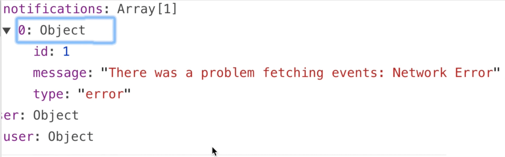

<link rel="stylesheet" href="assets/style.css" type="text/css" />
# 成功與失敗通知

在我們範例應用程式裡面，有些地方的 Vuex 程式碼，像是呼叫 API 等等我們有去捕捉錯誤。目前我們只是簡單的把錯誤訊息 log 到 console 上面。但是這樣對使用者不是很有幫助，他們應該在錯誤發生的時候被通知才行。

所以在這個章節我們將學會要怎麼在成功或失敗的 Action 發生時把通知加到 Vuex store 裡，再來學習把通知顯示在我們的 UI 上。

## 問題：記錄和顯示通知

App 中的執行錯誤和成功也許會在很多不同的地方，組件以及 Vuex Action 發生。

我們需要有個好方法來記錄它們好讓他能在整個應用程式裡面共享。

## 解決方案：一個專屬的 Vuex 模組

很合理的，Vuex 在我們需要共享 State 的時候是最佳解決方案。再上一個章節，我們學會了將 Vuex 程式碼封裝到模組中。以現在的情況我們需要一個新的 **notification** 模組來儲存 App 中的成功和錯誤通知。然後再將這些通知顯示給使用者看。

現在讓我們先來建立 **notification** 模組，而且要確認它啟用了命名空間。

📃 **/src/store/modules/notification.js**

```javascript
  export const namespaced = true
  
  export const state = {
    notifications: []
  }
```

請看👆的程式碼，`notification` State 是一個陣列。而我們想要把通知加到這個陣列裡面，而且我們也想要有能夠從裡面移除通知的功能。因此我們會利用 Mutation 來完成這些功能。

📃 **/src/store/modules/notifications.js**

```javascript
  let nextId = 1
  
  export const mutations= {
    PUSH(state, notification){
      state.notification.push({ 
        ...notification, // 代表原來 notification 的屬性，因為要在傳入的 notification 物件後面再加上新的屬性，所以要這樣寫。
        id: nextId++ // 再加上一個新的屬性
    })
  },
  DELETE(state, notificationToRemove) {
    state.notifications = state.notifications.filter(
                            notification => notification.id !== notificationToRemove.id
                )
              }
  }
```

不意外的，`PUSH` Mutation 負責把被當作酬載的新通知加入到 `notifications` 陣列。而且再加上一個 `id` 屬性，它的值就用變數 `nextId` 的值。這樣可以保證每個新的通知都有唯一的 id，我們後面會用到它。

`DELETE` Mutation 接受 `messageToRemove` 為酬載，它會被用來篩選 `notifications`，從 State 中移除指定的通知。

📃 **/src/store/modules/notification.js**

```javascript
  ...
  export const actions = {
    add({ commit }, notification) {
      commit('PUSH', notification)
    },
    remove({ commit }, notificationToRemove) {
      commit('DELETE', notificationToRemove)
    }
  }
```

最後把這個模組加到我們的 **store.js** 檔。

📃 **/src/store/store.js**

```javascript
  import * as notification from '@/store/modules/notification.js'
  
  export default new Vuex.Store({
    modules: {
      user,
      event,
      notification // <--- 新加入的模組
    }
  }
```

很好！現在 **notification** 模組準備好了！

## 加入錯誤通知

現在，我們在上個章節建立的 **event** 模組中，我們有個 `fetchEvents` 的 Action，它會呼叫 API 以從我們的模擬伺服器上取回活動。

📃 **/src/store/modules/event.js**

```javascript
  fetchEvents({ commit, dispatch }, { perPage, page }) {
    
    EventService.getEvents(perPage, page)
      .then( response => {
        commit('SET_EVENTS_TOTAL', parseInt(response.headers['x-total-count']))
        commit('SET_EVENTS', response.data)
        })
        .catch(error => {
          console.log('There was an error:', error.response) // <-- 就在這邊
        })
      }
  },
```

從👆的程式碼可以看到，如果我們 `catch` 到一個錯誤，我們只是把它記錄到 console 而已。與其如此，我們想要 dispatch 我們 **notification** 模組裡面的 `add` Action，來把錯誤加入到 `notifications` State 裡面。

加入後看起來像👇這樣：

```javascript
  ...
    .catch(error => {
      const notification = {
        type: 'error',
        message: 'There was a problem fetching events: ' + error.message
        }
        dispatch('notification/add', notification, { root: true })
      })
```

在👆的程式碼，我們建立了一個 `notification` 物件，它的 `type` 屬性是 `'error'` 還有一個 `message` 屬性描述錯誤訊息。

接著我們把 `notification` 物件當作酬載傳進 Action。因為 `notification` 模組已經啟用命名空間，我們就可以以 `notification/add` 來 dispatch `add` Action。

第三個引數，`{ root: true }` 很重要。這告訴 `dispatch` 在 根 store 去找 `notification/add` 這個 Action，而不是只在目前的模組去找。

## 檢驗通知模組

因為 `fetchEvents` Action 在 **EventList** 頁面被 dispacth 的，我們可以試試看在 json-server 關掉的情形下瀏覽這個頁面。沒有了模擬伺服器 API 呼叫就會失敗，然後錯誤通知就會被加入到 Vuex State。

如果我們檢查一下 DevTools 的 Vuex tab，就可以看到錯誤加到 `notifications` State 裡。👍！



## 更多的錯誤通知

還有一些地方可能會發生錯誤，我們也想要在那裡面加入 `add` Action。

再回到 **event** 模組，我們還有一個 `fetchEvent` 的 Action 只是把錯誤記錄到 console 上。

📃 **/src/store/modules/event.js**

```javascript
  fetchEvent({ commit, getters, dispatch }, id) {
    var event = getters.getEventById(id)
    if (event) {
      commit('SET_EVENT', event)
    } else {
      EventService.getEvent(id)
        .then(response => {
          commit('SET_EVENT', response.data)
        })
        .catch(error => {
          console.log('There was an error:', error.response) // <-- 就在這邊
        })
    }
  }
```

然後修改捕捉錯誤處理那段程式碼。

📃 **/src/store/modules/event.js**

```javascript
  ...
    .catch(error => {
      const notification = {
        type: 'error',
        message: 'There was a problem fetching an event: ' + error.message
      }
      dispatch('notification/add',notification,{ root: true })
    })
  ...
```

這樣一來 app 嘗試 `fetEvents` 或 `fetEvent` 而產生的錯誤就會被加入到 **notification** 模組裡了。

## 成功和錯誤通知

現在還有一個地方要加入通知程式碼。跟前面的差別是，除了錯誤我們還要加入成功通知。

再打開 **event** 模組，跳到裡面的 `createEvent` Action。

📃 **/src/store/modules/event.js**

```javascript
  createEvent({ commit }, event) {
    return EventService.posEvent(event).then(() => {
      commit('ADD_EVENT', event)
    })
  }
```

我們可以在活動被加入到模擬資料庫的時候也加入成功通知道 **notification** 模組。

📃 **/src/store/modules/event.js**

```javascript
  createEvent({ commit, dispatch }, event) {
    return EventService.postEvent(event)
      .then(() => {
        commit('ADD_EVENT', event)
        const notification = {
          type: 'success',
          message: 'Your event has been created!'
        }
        dispatch('notification/add', notification, { root: true })
      })
  }
```

👆這段程式碼看起來十分的熟悉。特別是在建立和呼叫 `notification` 物件那段。只是呼叫的時機和錯誤通知不同。

接著我們再來加入 `catch` 部分的通知。

📃 **/src/store/modules/event.js**

```javascript
  ...
        dispatch('notification/add', notification, { root: true })
      })
      .catch(error => {
        const notification = {
          type: 'error',
          message: 'There was a problem creating your event: ' + error.message
        }
        dispatch('notification/add', notification, { root: true })
        throw error
      })
    }
```

同樣的我們再一次建立了新的 `notification` 物件然後把它當作酬載 dispatch 到 `add` Action。

我們還需要把`錯誤(error)`往上`丟(throw)`，藉此把錯誤傳到組件去。讓我們回頭來看看 **EventCreate** 組件，如果 `error` 被抓到的話，我們不會把路由 `$route.push` 出去，也不會清除 `this.event` 的內容。

我們可以順便把組件上面捕捉到錯誤然後把錯誤記錄到 console 的程式碼都拿掉。

```javascript
  createEvent() {
    this.$store.dispatch('event/createEvent', this.event).then(() => {
      this.$router.push({
        name: 'event-show',
        params: { id: this.event.id }
      })
      this.event = this.createFreshEventObject()
    })
    .catch(() => { // <-- 刪除
      console.log('There was a problem creating your event') // <-- 刪除
    }) // <-- 刪除
  }
```

## 顯示通知

我們以及跟為 Vuex 程式碼新增了加入和存放通知的能力， 接下來就是要做在 app 中顯示通知的功能了。我們會透過建立幾個組件來完成這個功能。

1. **NotificationBar.vue**：會用來顯示通知訊息。
2. **NotificationContainer.vue**：會為每個在 State 的通知建立一個 **NotificationBar**。

先從 **NotificationBar** 開始唄～

📃 **/src/components/NotificationBar.vue

```javascript
  <template>
    <div class="notification-bar">
      <p>{{ notification.message }}</p>
    </div>
  </template>
  
  <script>
    export default {
      props: {
        notification: {
          type: Object,
          required: true
        }
      }
    }
  </script>
  
  <style scoped>
    .notification-bar {
      margin: 1em 0 1em;
    }
  </style>
```

👆的程式碼，我們把 `notification.message` 放在 `p` 標籤裡，這個組件本身會接收一個 **notification** 物件當作是 `prop` 屬性。

為了要把成功和失敗通知的樣式做個區別，我麼加入了一個利用 `notification` 物件中 `type` 屬性的 `computed` 屬性來建立 要使用的 `class` 名稱。

```javascript
  ...
    computed: {
      notificationTypeClass() {
        return '-text-${this.notification.type}'
      }
    }
```

這個屬性會基於 `notification` 物件的 `type` 屬性回傳 '-text-success' 或 '-text-error'，這個 css class 會把通知依類型把通知的樣式設為黑色或紅色。

再來我們只需要用 v-bind 把 css class 綁定到 div 標籤。

```javascript
  <div class="notification-bar"
        :class="notificaitonTypeClass"> <-- 綁定 computed 屬性
    <p>{{ notification.message }}</p>
  </div>
```

## 堆進 NotificationContainer

輪到建立我們的 **NotificationContainer** 組件了，然後用它來建立我們的 **NotificationBar** 組件。

📃 **/src/components/NotificationContainer.vue**

```javascript
  <template>
    <div class="notification-container">
      <NotificationBar
        v-far="notification in notifications"
        :key="notification.id"
        :notification="notification"
      />
    </div>
  </template>
  
  <script>
    import NotificationBar from './NotificationBar'
    import { mapState } from 'vuex'
    
    export default {
      components: { NotificationBar },
      computed: mapState('notification',['notifications'])
    }
  </script>
  
  <style scoped>
    .notification-container {
      position: fixed;
      bottom: 0;
    }
  </style>
```

從👆的程式碼來看，我們匯入了 **NotificationBar** 和 **mapState**。接著利用 `v-for` 為 **notification** state 裡每個 `notifications` 建立 **NotificationBar**，我們把 `notifications` 映射到 `computed` 屬性。

注意一下我們是怎麼在 **NotificationBar** 建立時把每一個 `notification` 餵進去 `prop` 裡面，然後利用 `notification.id` 為每個組件建立唯一鍵值。

接下來我們只需要為 **NotificationContainer** 找個地方顯示即可。

## 把 NotificationContainer 加到 APP.js

因為我們想要讓通知在全部的地方都看得到，以 app 層級來看，我們打算把 **NotificationContainer** 組件匯入到 app 最底層的組件：**App.vue**。然後把它放到 App 的樣板裡面，像👇這樣：

📃 **/src/App.vue**

```javascript
  <template>
    <div id="app">
      <NavBar />
      <NotificationContainer />
      <router-view :key="$router.fullPath" />
    </div>
  </template>
  
  <script>
    import NavBar from '@/components/NavBar.vue'
    import NotificationContainer from '@/components/NotificationContainer.vue'
    
    export default {
      components: {
        NavBar,
        NotificationContainer
      }
    }
  </script>
```

## 移除通知

從前面的內容裡，我們已經在 **notification** 模組裡面加入了 `remove` 的功能。所以我們什麼時候想要使用它呢？其中一個會用到它的方式是，我們為已經顯示的通知設定經過一定的時間，比如說 5 秒鐘。在 5 秒鐘時間到的時候，通知會把自己給移除。

來看看要怎麼做到。我們可以先來利用 `mapActions` 為 **NotificationBar** 組件加入能 dispatch `remove` Action 的能力。

📃 **/src/components/NotificationBar.vue**

```javascript
  iomport { mapActions } from 'vuex'
  ...
    props: {
      notification: {
        type: Object,
        required: true
      }
    },
    methods: mapActions('notification',['remove'])
    ...
```

當我們在 dispatch 這個 Action 的時候，程式碼看起來會像是👇這樣：
`this.remove(this.notification)`。我們傳入`notification`屬性當作是酬載。

那什麼時候要觸發 `this.remove(this.notification)` 呢？和前面說的一樣，可以在顯示後 5 秒後觸發。換句話說，也就是在 **NotificationBar** 組件 mount 到 DOM 之後經過 5 秒觸發。也因為這樣我們可以把它放到 `mounted` 的生命週期鉤子(hook)

📃 **/src/components/NotificationBar.vue**

```javascript
  ...
    data() {
      return {
        timeout: null
      }
    },
    mounted() {
      this.timeout = setTimeout(() => this.remove(this.notification), 5000)
    },
    methods: mapActions('notification', ['remove'])
```

在👆的程式碼裡面我們在 `data` 屬性加入了 `timeout` 物件，然後設定到 `setTimeout` 函式中，這個函式會在 `mounted` 後等待 5 秒（5000毫秒）然後 dispatch `remove` Action。換句話說，當這個組件被 `mounted` 之後，就表示通知已經顯示在畫面上了，而在倒數 5 秒後再把這個通知給刪掉。

但我們為何要把 `timeout` 放在 `data` 裡面呢？我們不能直接在 `mounted` 裡面呼叫嗎？我們要這麼做的原因是因為要確保在組件被摧毀前要清除 `setTimeout`，像👇這樣：

📃 **/src/components/NotificationBar.vue**

```javascript
  ...
    beforeDestroy() {
      clearTimeout(this.timeout)
    },
  ...
```

藉由讓組件在沒有被顯示的時候不讓 `setTimeout` 繼續執行可以避免[記憶體洩漏](https://medium.com/outsystems-experts/beyond-memory-leaks-in-javascript-d27fd48ae67e)。